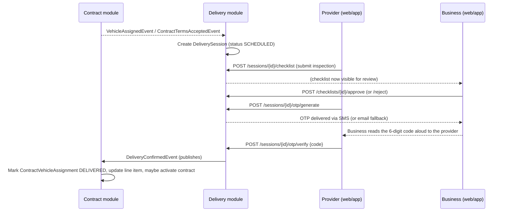
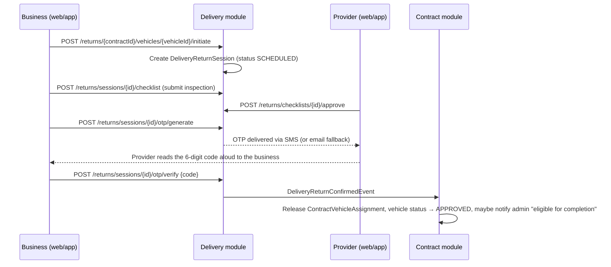

# Delivery Module — Specification

**Module Name:** Delivery
**Version:** 2.0 (rewritten against running code)
**Last verified against code:** 2026-07-23
**Location:** `Modules/Delivery/**` inside `Marketplace.API` (.NET 9 modular monolith) — this is a folder/namespace inside one deployable, not a separate service with its own database
**Related documents:** `project-docs/service-specs/15_Delivery_OTP_Verification_Flow_Specification.md` (full step-by-step flow with sequence diagrams — the primary source this rewrite draws from), `backlog/mvp/epic-07-otp-delivery-verification.md`

---

## What changed in this rewrite

The previous version of this document described a single one-directional OTP flow (provider delivers, business confirms), a mandatory 5-photo + odometer + fuel-level "handover" evidence record captured at every delivery, hashed OTP codes, a 3-attempt lockout with a configurable block duration, and a "future" GPS location-verification note. Reading `Modules/Delivery/**` directly shows none of that matches the running system:

1. **Not a microservice, no separate `delivery` database.** One deployable, one PostgreSQL database. Most Delivery tables (`delivery_sessions`, `delivery_otps`, `delivery_return_sessions`, `return_otps`, `delivery_vehicle_handovers`) use the default schema; only the checklist and dead-entity tables (`vehicle_inspection_checklists`, `vehicle_inspection_checklist_responses`, `delivery_sla_violations`, `delivery_failure_reasons`, `delivery_event_logs`) use an explicit `delivery` EF Core schema. This is cosmetic table grouping inside one shared database, not schema-level data isolation.
2. **The real system is two symmetric OTP flows, not one.** An outbound delivery OTP (provider → business) and an inbound return OTP (business → provider) use identical entity shapes with swapped roles — this is a deliberate mirror design, not an add-on.
3. **There is no photo/odometer "handover" evidence step in the live flow.** `DeliveryVehicleHandover` (5 photos + odometer + fuel level) exists in the domain model and migrations, but **no command handler, controller, or event handler anywhere writes to it.** It was superseded by a **vehicle inspection checklist system** — structured yes/no, enum, and numeric fields (fuel level, odometer, tyre condition, lights, damage flags, etc.) with server-evaluated warning flags, gating both OTP flows. No photo upload exists anywhere in the live checklist system.
4. **OTP codes are stored in clear text, not hashed**, and are **never returned by any API response** — delivered exclusively via SMS/email, by design (confirmed by the query handler's own doc comment). There is no server-side attempt counter or lockout — a failed verification simply throws and the caller must request a fresh OTP.
5. **OTP expiry is 5 minutes in practice, not 15.** Both `DeliveryOTP.Create()` and `ReturnOTP.Create()` accept a `validityMinutes` parameter with different entity-level defaults (15 and 5 respectively), but every real call site (`GenerateOTPCommandHandler`, `GenerateReturnOTPCommandHandler`) explicitly passes `validityMinutes: 5` — so both flows are 5 minutes in production regardless of the entity defaults.
6. **No GPS/location verification exists anywhere**, confirmed absent by direct grep (`Latitude`/`Longitude`/`GPS` — zero hits in `Modules/Delivery/`). `DeliverySession.LocationAddress` is a nullable free-text column that every session-creation code path passes as `null`. This matches epic-15 (Geofence/GPS, post-MVP) being confirmed Not Started on every surface.
7. **Contract activation is per-vehicle and aggregate, not per-session.** Each vehicle's OTP verification marks only that vehicle's `ContractVehicleAssignment` as delivered; full contract `ACTIVE` status and `ContractActivatedEvent` only fire once **every** awarded vehicle across every line item has been delivered — this can be many individual OTP verifications apart from the first one on a multi-vehicle contract.

---

## Overview

### Purpose

The Delivery module verifies the physical handover of a vehicle between provider and business — both outbound (delivery) and inbound (return) — through a checklist-gated, OTP-confirmed mechanism. It does not move any money (Finance module reacts to its events but the delivery/return confirmation handlers themselves are financially inert), does not own the contract's overall status field (Contracts module owns `Contract.Status` and reacts to `DeliveryConfirmedEvent`/`DeliveryReturnConfirmedEvent`), and does not perform any location/GPS verification (not built).

### Two symmetric, mirrored flows

| Flow | Who fills the checklist | Who approves the checklist | Who requests the OTP | Who receives the OTP | Who enters the code |
|---|---|---|---|---|---|
| **Delivery** (outbound, provider → business) | Provider | Business | Provider | **Business** | Provider (told the code by the business) |
| **Return** (inbound, business → provider) | Business | Provider | Business | **Provider** | Business (told the code by the provider) |

Both flows use identical entity shapes (`DeliverySession`/`DeliveryOTP` vs. `DeliveryReturnSession`/`ReturnOTP`), and share one `VehicleInspectionChecklist` entity type discriminated by a `HandoverType` (`DELIVERY`|`RETURN`) field — but the *roles* are swapped between them by design.

### Responsibilities

**Session orchestration**
- Creating `DeliverySession`/`DeliveryReturnSession` rows (automatically off contract-lifecycle events, or explicitly via provider/business-initiated endpoints), idempotently — never duplicating a session for a vehicle that already has one

**Vehicle inspection checklist gate**
- Serving the active checklist template (MasterData-owned `ChecklistTemplateItem` rows, filtered by EV/non-EV and delivery/return applicability)
- Accepting structured responses, validating all required items are answered, computing server-side warning flags
- Routing approval/rejection to the counter-party

**OTP generation & verification**
- Generating a cryptographically random 6-digit code, hard-blocked until the matching checklist is `APPROVED`
- Delivering the code exclusively out-of-band (SMS primary, email fallback) — never through any API response
- Verifying the code and marking the session `COMPLETED`, publishing the event that drives contract-side state changes

**Cross-module signaling**
- Publishing `DeliveryConfirmedEvent`/`DeliveryReturnConfirmedEvent`, consumed by the Contracts module to advance `ContractVehicleAssignment`/`ContractLineItem`/`Contract` status and (on first delivery) anchor the settlement schedule

**Dead schema (modeled, not wired — see Known Gaps)**
- `DeliveryVehicleHandover` (photo/odometer/fuel evidence), `DeliverySLAViolation`, `DeliveryFailureReason`, `DeliveryEventLog` — all exist in the domain model, DbContext, and migrations, with zero write-path callers anywhere in the backend

---

## Database Schema

| Table | Schema | Purpose |
|---|---|---|
| `delivery_sessions` | default | `DeliverySession` — outbound delivery session header |
| `delivery_otps` | default | `DeliveryOTP` — one-time codes for delivery sessions |
| `delivery_return_sessions` | default | `DeliveryReturnSession` — inbound return session header (mirror of `DeliverySession`) |
| `return_otps` | default | `ReturnOTP` — one-time codes for return sessions |
| `delivery_vehicle_handovers` | default | `DeliveryVehicleHandover` — 5-photo/odometer/fuel evidence record; **entity/table exist, nothing writes to it** |
| `vehicle_inspection_checklists` | `delivery` | `VehicleInspectionChecklist` — one row per delivery or return session, `HandoverType`-discriminated |
| `vehicle_inspection_checklist_responses` | `delivery` | `VehicleInspectionChecklistResponse` — one row per checklist item per inspection |
| `delivery_sla_violations` | `delivery` | `DeliverySLAViolation` — no-show/violation tracking; **entity/table exist, nothing writes to it** |
| `delivery_failure_reasons` | `delivery` | `DeliveryFailureReason` — standardized failure-code lookup; **entity/table exist, nothing writes to it** |
| `delivery_event_logs` | `delivery` | `DeliveryEventLog` — generic audit-log entity, distinct from the module's actual audit trail (structured `ILogger` application logging); **entity/table exist, nothing writes to it** |

Checklist template items themselves (`ChecklistTemplateItem`) are owned and seeded by the **MasterData** module, not by Delivery — Delivery only reads them.

---

## Module Structure (actual folders)

```
Modules/Delivery/
├── Domain/
│   ├── Entities/
│   │   ├── DeliverySession.cs, DeliveryOTP.cs
│   │   ├── DeliveryReturnSession.cs, ReturnOTP.cs
│   │   ├── VehicleInspectionChecklist.cs, VehicleInspectionChecklistResponse.cs
│   │   ├── DeliveryVehicleHandover.cs        (no write path — see Known Gaps)
│   │   ├── DeliverySLAViolation.cs           (no write path — see Known Gaps)
│   │   ├── DeliveryFailureReason.cs          (no write path — see Known Gaps)
│   │   └── DeliveryEventLog.cs               (no write path — see Known Gaps)
│   ├── Events/
│   │   ├── OTPGeneratedEvent.cs, OTPVerifiedEvent.cs
│   │   ├── ReturnOTPGeneratedEvent.cs
│   │   ├── ReturnSessionInitiatedEvent.cs
│   │   ├── ChecklistEvents.cs (DeliveryChecklistApprovedEvent, ReturnChecklistApprovedEvent, ReturnChecklistSubmittedEvent, …)
│   │   ├── DeliveryConfirmedEvent.cs
│   │   └── DeliveryReturnConfirmedEvent.cs
│   └── Repositories/ (IDeliverySessionRepository, IDeliveryOTPRepository, IDeliveryReturnSessionRepository, IReturnOTPRepository, IVehicleInspectionChecklistRepository, IDeliveryVehicleHandoverRepository)
│
├── Application/
│   ├── DeliverySessions/Commands/ (RequestDeliveryConfirmation, GenerateOTP, VerifyOTP)
│   ├── DeliverySessions/Queries/ (GetDeliverySession, GetDeliverySessionsByContract, GetDeliveryTimelineQuery, GetPendingOTP, GetBusinessPendingOTPs)
│   ├── ReturnSessions/Commands/ (InitiateReturn, GenerateReturnOTP, VerifyReturnOTP)
│   ├── ReturnSessions/Queries/ (GetReturnSession, GetReturnSessionsByContract)
│   ├── Checklist/Commands/ (SubmitChecklist — houses both SubmitDeliveryChecklistCommandHandler and SubmitReturnChecklistCommandHandler, ApproveChecklist, RejectChecklist)
│   ├── Checklist/Queries/ (GetChecklistTemplate, GetInspectionChecklist)
│   └── EventHandlers/ (VehicleAssignedEventHandler, ContractTermsAcceptedEventHandler — both create `DeliverySession` rows; OTPGeneratedEventHandler, ReturnOTPGeneratedEventHandler — SMS/email dispatch)
│
└── Infrastructure/
    ├── Configurations/DeliveryConfigurations.cs, VehicleInspectionChecklistConfiguration.cs
    └── Repositories/ (one per Domain/Repositories interface)
```

Controllers live outside the module folder: `Controllers/Delivery/DeliveryController.cs` (`[Route("api/delivery")]`, web) and `Controllers/Mobile/MobileDeliveryController.cs` (`[Route("mobile/delivery")]`, both mobile apps) — thin wrappers around the identical MediatR commands/queries; there is exactly one implementation of every business rule behind two route prefixes. The mobile controller adds two routes the web controller doesn't have: dedicated `POST returns/checklists/{checklistId:guid}/approve` and `.../reject` (provider-only) alongside the shared `POST checklists/{checklistId}/approve`/`reject` both controllers expose.

---

## Core Entities (field-level)

### DeliverySession
- `ContractId`, `VehicleId`, `ProviderId`, `BusinessId`, `SessionReference`, `Status` (`SCHEDULED`|`IN_PROGRESS`|`COMPLETED`|`CANCELLED` — string, no enum type)
- `ScheduledTime`, `ActualTime` (stamped on `Complete()`), `LocationAddress` (nullable, **always written as `null` by every session-creation code path today** — see What Changed #6), `DriverName`/`DriverPhone` (settable via `AssignDriver()`, not populated by any traced call site in this pass)
- Navigation: `OTPs`, `Handover` (dead — see Known Gaps), `InspectionChecklist`
- Domain methods: `Start()` (→ `IN_PROGRESS`, **no controller action drives this for delivery sessions today** — the flow goes `SCHEDULED → COMPLETED` directly on OTP verification), `Complete()`, `Cancel()`, `AssignDriver(name, phone)`

### DeliveryOTP
- `DeliverySessionId`, `Code` (6-digit numeric, **stored in clear text**, `RecipientRole = "BUSINESS"` always for this flow), `ExpiresAt`, `IsUsed`/`UsedAt`
- `Create()`'s entity-level default is `validityMinutes: 15`, but `GenerateOTPCommandHandler` always passes `validityMinutes: 5` explicitly — **production behavior is 5 minutes**, not the entity default
- `VerifyCode(input)` — checks `!IsUsed && DateTime.UtcNow <= ExpiresAt && Code == input`; no attempt counter or lockout field exists on this entity

### DeliveryReturnSession
- Exact mirror of `DeliverySession`: `ContractId`, `VehicleId`, `ProviderId`, `BusinessId`, `SessionReference`, `Status` (same four values), `ScheduledTime`/`ActualTime` — no `LocationAddress`/driver fields on this one
- Navigation: `OTPs` (of type `ReturnOTP`), `InspectionChecklist`
- Domain methods: `Start()` (also has no controller action driving it today), `Complete()`, `Cancel()`

### ReturnOTP
- `ReturnSessionId`, `Code`, `RecipientRole = "PROVIDER"` always for this flow, `ExpiresAt`, `IsUsed`/`UsedAt`
- `Create()`'s entity-level default is `validityMinutes: 5`, and the one real call site (`GenerateReturnOTPCommandHandler`) also passes `validityMinutes: 5` — consistent 5-minute expiry on this side
- Same `VerifyCode()` shape as `DeliveryOTP` — no attempt counter/lockout

### VehicleInspectionChecklist
- `DeliverySessionId` **or** `ReturnSessionId` (mutually exclusive, matching `HandoverType`), `HandoverType` (`DELIVERY`|`RETURN`)
- `SubmittedByName`, `ReviewedByName`, `HasWarningFlags` (true if any response row has `HasWarning == true`), `Status` (`SUBMITTED → APPROVED | REJECTED`), `Notes`, `SubmittedAt`
- Factory methods `CreateForDelivery()`/`CreateForReturn()`; `EvaluateWarnings()`/`SetWarningFlags()`, `AddResponse()`, `Approve(reviewedByName)`, `Reject(reviewedByName)`

### VehicleInspectionChecklistResponse
- `ChecklistId`, `TemplateItemId` (FK to MasterData's `ChecklistTemplateItem`), `ResponseValue` (string — `"true"`/`"false"` for BOOL, an enum label for ENUM, a numeric string for NUMERIC, free text for TEXT), `HasWarning`, `WarningNote` (auto-populated as `"{Label} needs attention"` when a warning triggers)

### DeliveryVehicleHandover (dead — no write path)
- `DeliverySessionId`, `HandoverType`, `FrontPhotoUrl`/`BackPhotoUrl`/`LeftPhotoUrl`/`RightPhotoUrl`/`InteriorPhotoUrl` (all required), `OdometerReading`, `FuelLevel`, `Notes`, `HandoverTime`
- The 5-photo/odometer/fuel-level evidence model the previous version of this spec described as live — `Create()` has zero call sites in the current codebase

### DeliverySLAViolation (dead — no write path)
- `DeliverySessionId`, `ViolationType`, `Description`, `PenaltyAmount` (nullable) — no-show/SLA-violation tracking with an optional penalty amount, never created by any code path

### DeliveryFailureReason (dead — no write path)
- `Code`, `Description`, `Category` (`PROVIDER_FAULT`|`BUSINESS_FAULT`|`OPERATIONAL`|`TECHNICAL`), `PenaltyApplicable`, `IsActive` — a standardized lookup table, never populated or referenced by any live flow

### DeliveryEventLog (dead — no write path)
- Generic audit-log entity; the module's actual audit trail today is structured `ILogger` application logging, not this table

---

## Vehicle Inspection Checklist Template (MasterData-owned, Delivery-consumed)

`GET /api/delivery/checklist-template?isEv={bool}&isReturn={bool}` returns active `ChecklistTemplateItem` rows. The seeded default template (`MasterDataSeeder.SeedChecklistTemplateItemsAsync`) includes items such as:

| Code | Label | Type | Warning trigger |
|---|---|---|---|
| `FUEL_LEVEL` | Fuel level | ENUM (`EMPTY`/`QUARTER`/`HALF`/`THREE_QUARTER`/`FULL`) | `EMPTY` |
| `BATTERY_PERCENT` (EV only) | Battery charge (%) | NUMERIC | `< 20` |
| `ODOMETER_KM` | Odometer reading (km) | NUMERIC | — |
| `VISIBLE_DAMAGE` | Visible damage (dents/scratches)? | BOOL | `true` |
| `WINDOWS_INTACT` | All windows intact | BOOL | `false` |
| `TYRE_CONDITION` | Tyre condition | ENUM (`GOOD`/`ACCEPTABLE`/`POOR`) | `POOR` |
| `SPARE_TYRE` | Spare tyre present | BOOL | `false` |
| `LIGHTS_OK` | All lights operational | BOOL | `false` |
| `DASHBOARD_WARNINGS` | Dashboard warning lights on? | BOOL | `true` |
| `JACK_TOOLS` | Jack and emergency tools present | BOOL | `false` |
| `DOCS_IN_VEHICLE` | Vehicle documents in car | BOOL | `false` |
| `KEYS_COUNT` | Number of keys handed over | NUMERIC | — |
| `DRIVER_ID_VERIFIED` (delivery only) | Driver credentials verified | BOOL | `false` |
| `CHARGING_CABLE` / `CHARGING_ADAPTER` (EV only) | Charging cable/adapter present | BOOL | `false` |

No fixed 5-photo requirement, no server-side odometer-delta calculation, and no free-text damage-description field beyond the checklist header's general `Notes`. Warning evaluation (`EvaluateWarning()` in `SubmitChecklistCommandHandler`) does an exact-match comparison against `WarningThreshold` for BOOL/ENUM items, or a `< limit` numeric comparison for NUMERIC items whose threshold starts with `<`.

The web app's return flow additionally shows a **client-side** delivery-vs-return comparison table (fetches both checklists independently and diffs them in React) — there is no backend "damage delta" entity or endpoint behind it.

---

## Key Workflows

### 1. Delivery flow (outbound: provider → business)



**Session creation (two paths, both idempotent):**
- **Automatic:** `VehicleAssignedEventHandler` (contract already delivery-eligible) or `ContractTermsAcceptedEventHandler` (contract just exited the dual-party signing gate — eligible statuses `PENDING_DELIVERY`/`PARTIALLY_DELIVERED`/`PARTIALLY_RETURNED`) creates one `DeliverySession` per newly-`ASSIGNED` vehicle, scheduled for `now + 1 day`, skipping vehicles that already have a session.
- **Explicit:** `POST /api/delivery/contracts/{contractId}/vehicles/{vehicleId}/request-confirmation` (provider-initiated). If a `SCHEDULED` session already exists it's returned as-is; this endpoint never generates an OTP itself.

**Checklist:** provider submits (`POST /sessions/{sessionId}/checklist`, only while the vehicle assignment is `ASSIGNED` or `SCHEDULED`); business approves/rejects (`POST /checklists/{checklistId}/approve|reject`). Approval publishes `DeliveryChecklistApprovedEvent`, which nothing currently subscribes to beyond logging/notification wiring — it does not itself trigger OTP generation.

**OTP generation** (`POST /sessions/{sessionId}/otp/generate`): requires `Status == "SCHEDULED"` and an `APPROVED` checklist (`GenerateOTPCommandHandler` throws otherwise). Generates a cryptographically random 6-digit code (`RandomNumberGenerator.GetInt32`), 5-minute expiry, `RecipientRole = "BUSINESS"`. The API response never contains the code (`GenerateOTPResponseDto.Code` is always empty) — delivery is via `OTPGeneratedEvent` → SMS (RabbitMQ, when `FeaturesSettings.SmsEnabled`) or email fallback. Two handlers subscribe to the same event (one Delivery-module SMS publisher, one Notifications-module SMS/email chooser), both gated on the same flag, so only one channel fires per environment.

**OTP verification** (`POST /sessions/{sessionId}/otp/verify`, called by the **provider**, since the code is texted to the business who reads it aloud): validates against the latest non-used, non-expired OTP; marks it used, completes the session, publishes `OTPVerifiedEvent` and `DeliveryConfirmedEvent`.

**No GPS, no arrival radius, no arrival photos anywhere in this flow.**

### 2. What happens on delivery confirmation (Contracts module side)

`DeliveryConfirmedEventHandler` (in `Modules/Contracts`, not Delivery) is the single subscriber:
1. Marks the specific `ContractVehicleAssignment` `DELIVERED`, increments the parent line item's delivered-quantity counter.
2. Calls `Contract.UpdateStatusBasedOnDelivery()` — moves `PENDING_DELIVERY → PARTIALLY_DELIVERED → ACTIVE` incrementally, not via a hardcoded "all delivered" check.
3. **On the very first vehicle delivered for the contract**, generates the full settlement schedule (`GenerateSettlementScheduleCommand`), anchored from that first-delivery date — untouched by every subsequent delivery.
4. **Only once every awarded vehicle across every line item has been delivered**, publishes `ContractActivatedEvent`.

No escrow release is tied to delivery — escrow stays locked until the settlement cycle processes it (Finance module territory).

### 3. Return flow (inbound: business → provider) — a full mirror, not a footnote



**Initiation** (`POST /returns/{contractId}/vehicles/{vehicleId}/initiate`, body `{ initiatorRole }`): the controller allows either `BUSINESS` or `PROVIDER` to call it, though the intended flow is business-initiated. Requires the vehicle assignment to be `DELIVERED` or `ACTIVE`. Idempotent (returns the existing `SCHEDULED` session if present). Publishes `ReturnSessionInitiatedEvent`.

**Checklist:** business submits (`POST /returns/sessions/{sessionId}/checklist`, requires `DELIVERED`/`ACTIVE` assignment); provider approves (`POST /returns/checklists/{checklistId}/approve`) or rejects with a reason (mobile: `POST /returns/checklists/{checklistId}/reject`; web: the shared `POST /checklists/{checklistId}/reject`). After a rejection the business submits a corrected checklist (see **Rejection and resubmission** below).

**Rejection and resubmission (both flows, BR-015):** the reviewer rejects with an optional reason (`reviewReason`, max 500). The rejected checklist stays as history and the submitter is notified (`delivery_checklist_rejected` to the provider, `return_checklist_rejected` to the business; `ChecklistRejectedEvent` → `ChecklistRejectedNotificationHandler`). The submitter then sends a corrected checklist to the same submit endpoint. A session may have several checklists over time but at most one that is not `REJECTED` (filtered unique indexes on `deliverySessionId` / `returnSessionId`), and `GET .../checklist` returns the latest.

**OTP:** business calls `GenerateReturnOTPCommand` (requires `APPROVED` checklist), a 6-digit `ReturnOTP` (5-minute expiry, `RecipientRole = "PROVIDER"`) is sent to the provider. Business then calls `VerifyReturnOTPCommand` with the code the provider reads back.

**On return confirmation** (`DeliveryReturnConfirmedEventHandler`, Contracts module):
1. Releases the `ContractVehicleAssignment` (`Status → RETURNED`).
2. Sets the `Vehicle` back to `APPROVED` (available again).
3. Updates the line item's returned-quantity counters.
4. Recomputes contract status (can move to `PARTIALLY_RETURNED`).
5. **Only when every assignment on the contract is `RETURNED`**, sends an in-app admin notification flagging completion-eligibility — **no automatic settlement or contract completion follows.** Both require explicit admin action elsewhere in the Contracts module; this is a deliberate design choice, not a gap.

---

## Session and Checklist Status Reference

- **`DeliverySession.Status`** (string, no enum type): `SCHEDULED → IN_PROGRESS → COMPLETED`, or `CANCELLED`. In practice the wired flow never calls `Start()` — sessions go `SCHEDULED → COMPLETED` directly on OTP verification; `IN_PROGRESS`/`Cancel()` have no controller action driving them for delivery sessions today.
- **`DeliveryReturnSession.Status`**: same shape and caveat — no endpoint transitions a return session to `IN_PROGRESS` either.
- **`VehicleInspectionChecklist.Status`**: `SUBMITTED → APPROVED | REJECTED`. `REJECTED` is final for that checklist; the submitter continues with a new `SUBMITTED` checklist for the same session. The web UI additionally renders a `REPLACEMENT_REQUESTED` state for the case where a business rejects a delivery checklist and requests a different vehicle — this is a **client-side interpretation layer**, not a distinct backend value (`Reject()` only ever sets `Status = "REJECTED"`).
- **`DeliveryOTP`/`ReturnOTP`**: `IsUsed` (bool) + `ExpiresAt`, no status string. Verification failure just throws; there is no server-side attempt counter/lockout — the caller must generate a fresh OTP after any number of failed guesses.

---

## Endpoint Reference (as implemented)

Every endpoint exists twice — `api/delivery` (`DeliveryController`, web) and `mobile/delivery` (`MobileDeliveryController`, both mobile apps) — same MediatR commands/queries behind both; mobile adds `[Authorize]`, rate limiting, and role/verification guards.

**Delivery:**
- `POST sessions/{sessionId}/otp/generate` — provider, requires approved checklist
- `POST sessions/{sessionId}/otp/verify` — provider enters the business's code
- `GET sessions/{sessionId}`, `GET sessions/contract/{contractId}` (paginated), `GET contracts/{contractId}/timeline`
- `GET sessions/{sessionId}/otp` — pending OTP metadata, no code; `GET business/{businessId}/pending-otps` (mobile: `GET pending-otps`, business-only, current-user-scoped)
- `POST contracts/{contractId}/vehicles/{vehicleId}/request-confirmation` — provider, creates or returns existing session
- `GET checklist-template?isEv=&isReturn=` — template items for the current context
- `POST sessions/{sessionId}/checklist`, `GET sessions/{sessionId}/checklist` — provider submits (again after a rejection) / anyone fetches the latest
- `POST checklists/{checklistId}/approve`, `POST checklists/{checklistId}/reject` (body `{reviewedByName, reason?}`) — business

**Return:**
- `POST returns/{contractId}/vehicles/{vehicleId}/initiate` — business (or provider)
- `POST returns/sessions/{sessionId}/otp/generate` — business, requires provider-approved checklist
- `POST returns/sessions/{sessionId}/otp/verify` — business enters the provider's code
- `GET returns/sessions/{sessionId}`, `GET returns/sessions/contract/{contractId}`
- `POST returns/sessions/{sessionId}/checklist`, `GET returns/sessions/{sessionId}/checklist` — business submits
- `POST returns/checklists/{checklistId}/approve` (mobile also has a dedicated `POST returns/checklists/{checklistId}/approve`, provider-only, in addition to the shared endpoint) — provider
- `POST returns/checklists/{checklistId}/reject` (mobile, provider-only; body `{reviewedByName, reason?}`) — provider rejects; the business resubmits

---

## Known Gaps (verified by code search, zero call sites found for each)

1. **`DeliveryVehicleHandover` (5-photo/odometer/fuel evidence) is entirely dead schema.** Entity, repository, and DbContext registration all exist; `Create()` has zero callers anywhere in the backend. If photo evidence is wanted, it needs actual implementation — the table existing is not evidence the feature works.
2. **`DeliverySLAViolation`, `DeliveryFailureReason`, `DeliveryEventLog` are all dead schema** for the same reason — modeled, migrated, never written to. Confirmed via repo-wide grep for `.Handovers.`, `.SLAViolations.`, `.FailureReasons.`, `.EventLogs.` outside their own entity definitions.
3. **No GPS/geofence arrival confirmation exists.** No `Latitude`/`Longitude` columns, no arrival-radius check, no `EN_ROUTE`/`ARRIVED` distinction. `DeliverySession.LocationAddress` exists but is always `null` in practice. Matches epic-15 (post-MVP) being confirmed Not Started everywhere.
4. **No server-side OTP attempt counter or lockout.** Neither `DeliveryOTP` nor `ReturnOTP` has an `Attempts` field; a wrong guess just fails, with no escalating lockout behavior.
5. **`IN_PROGRESS` is unreachable for both session types.** `Start()` exists on both `DeliverySession` and `DeliveryReturnSession` but no controller action calls it — both flows go directly from `SCHEDULED` to `COMPLETED`.
6. **Return-checklist rejection on the web.** The provider app now rejects a return checklist (mobile `POST returns/checklists/{checklistId}/reject`) and the business app resubmits it; the web portal still exposes only approve for returns.
7. **`DeliveryChecklistApprovedEvent`/`ReturnChecklistApprovedEvent` have no functional subscribers** beyond logging/notification wiring — approving a checklist does not itself trigger OTP generation; that remains a separate explicit action by whichever party operates the OTP-request endpoint.
8. **The web return-flow's delivery-vs-return comparison table is client-side only** — both checklists are fetched independently and diffed in React; there is no backend "damage delta" entity or endpoint to build server-side tooling against.
9. **The provider mobile app's delivery-OTP screen renders a "Share OTP with Driver" panel that can never populate** — `GenerateOTPResponseDto.Code` is always empty by design (§5), so that panel is a latent UI artifact, not a security hole and not documentation of intended behavior.

---

## Integration Points

- **Contracts module:** publishes `VehicleAssignedEvent`/`ContractTermsAcceptedEvent` that trigger automatic `DeliverySession` creation; consumes `DeliveryConfirmedEvent`/`DeliveryReturnConfirmedEvent` to advance `ContractVehicleAssignment`/`ContractLineItem`/`Contract` status and anchor the settlement schedule on first delivery. Delivery's own commands read `ContractVehicleAssignment.Status` directly via `IContractsUnitOfWork` to gate checklist/session eligibility.
- **Finance module:** consumes `DeliveryConfirmedEvent` purely as a no-op status check (`FinanceDeliveryConfirmedEventHandler`) — confirms escrow is still locked, moves no money. Daily ledger accrual and settlement are decoupled, separately scheduled processes.
- **MasterData module:** owns and seeds `ChecklistTemplateItem` rows (delivery/return applicability, EV-only flags, warning thresholds) that Delivery reads but never writes.
- **Notifications module:** SMS/email dispatch of OTP codes (`OTPGeneratedEvent`/`ReturnOTPGeneratedEvent` handlers), gated on the same `FeaturesSettings.SmsEnabled` flag as the Delivery module's own RabbitMQ SMS publisher — in practice only one channel fires per environment configuration.
- **Web and both mobile apps:** implement the identical state machine (does a session exist → does a checklist exist and what's its status → is an OTP pending), polling every 10–30 seconds rather than subscribing to push updates — this flow does not push through the platform's SignalR `NotificationHub` even though that hub exists for general notifications.
