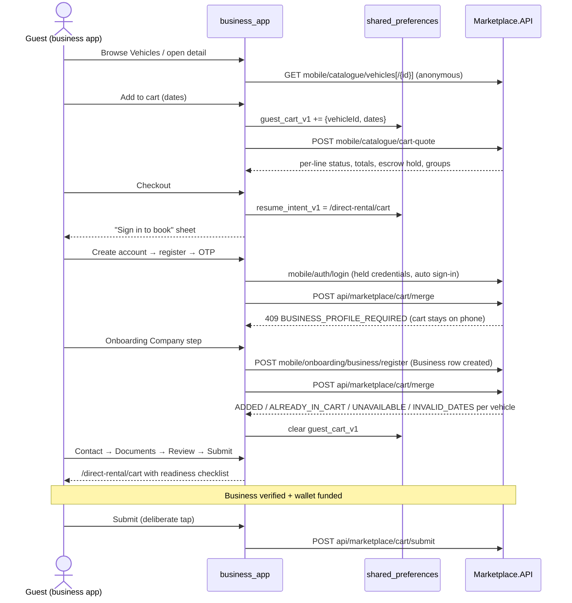
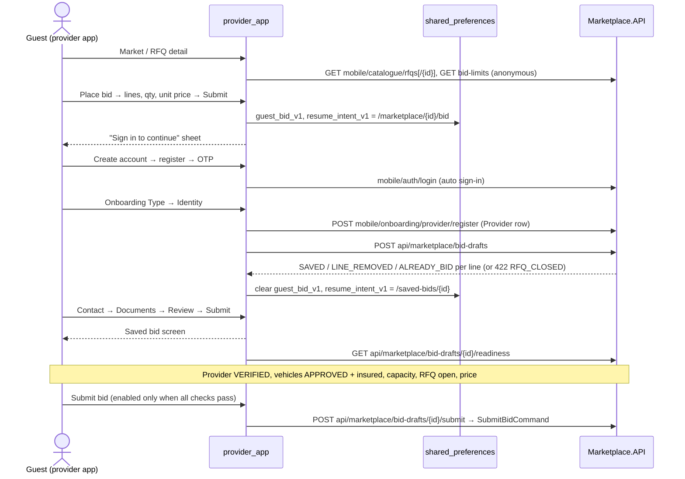
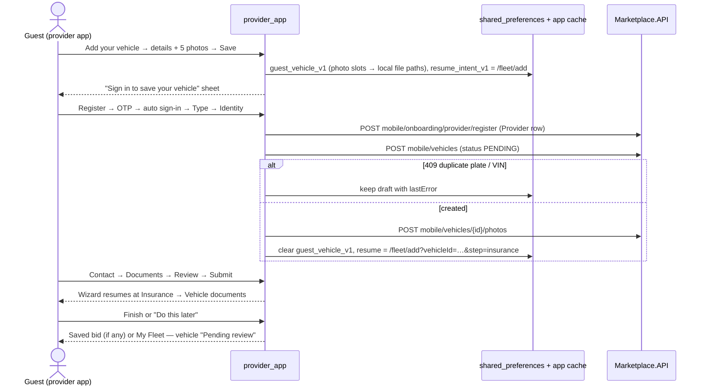

# Anqelba Car Rental MVP — Mobile Guest Mode Specification
## Browse Before Sign-In, Deferred Sign-Up & Draft Hand-Over — Version 1.0

**Document Status:** AUTHORITATIVE (mobile guest mode, both Flutter apps and the backend endpoints that serve them)
**Last verified against code: 2026-10-05** — verified directly against the backend branch `feature/mobile-guest-mode` (based on `feature/public-marketplace-api`; commits `8155f5e`, `0f6c72f`, `7ffc832`, `4bf7952`, `e2ed164`, `7559c6d`) and the mobile branches `feature/guest-mode` of `business_app` (`131b877`…`b5ab95e`) and `provider_app` (`121ff5a`…`ccdd64f`), both based on `release/r2-mobile`. Key files: `Controllers/Mobile/MobileCatalogueController.cs`, `Modules/Public/Application/Catalogue/**`, `Modules/Marketplace/Domain/Services/RentableVehicles.cs`, `Modules/Marketplace/Application/DirectRentalCart/Services/CartMergeService.cs`, `Modules/Marketplace/Application/BidDrafts/**`, `Controllers/Marketplace/DirectRentalCartController.cs`, `Controllers/Marketplace/BidDraftController.cs`, `Program.cs` (rate limiters), `Infrastructure/Keycloak/KeycloakInitializer.cs`; mobile: `lib/app/router/**`, `lib/features/auth/**` / `lib/app/session/**`, `business_app/lib/features/direct_rental/**`, `provider_app/lib/features/guest/**`, `provider_app/lib/features/bidding/**`, `provider_app/lib/features/fleet/presentation/screens/provider_fleet_add_screen.dart`.

**Implementation status:** built and tested on the branches above; not yet merged to `development`. Everything is additive: with the kill switch off (§2.6) both apps behave exactly as the login-first R2 builds.

**Related documents:**
- [MVP_DIRECT_RENTAL_SPECIFICATION.md](./MVP_DIRECT_RENTAL_SPECIFICATION.md) — the cart, submit and request lifecycle a guest cart ends up in
- [MVP_CONTRACT_STATE_MACHINE.md](./MVP_CONTRACT_STATE_MACHINE.md) — downstream contract lifecycle (unchanged by guest mode)
- [../05_BUSINESS_LOGIC_FLOWS.md](../05_BUSINESS_LOGIC_FLOWS.md) — "Guest Browsing & Deferred Sign-Up" flow summary
- [../03_API_SPECIFICATIONS.md](../03_API_SPECIFICATIONS.md) §10 — Mobile API surface, incl. `mobile/catalogue/*`
- [../04_MODULE_SPECIFICATIONS/Marketplace_Module.md](../04_MODULE_SPECIFICATIONS/Marketplace_Module.md) — shared services (`ICartMergeService`, `IBidDraftService`, `RentableVehicles`)

**Implementation reference:** `Marketplace.API` — Mobile controllers (`MobileCatalogueController`), Public module (anonymous catalogue queries, `IProviderRefGenerator`), Marketplace module (`ICartMergeService`, `IBidDraftService`, `RentableVehicles`, `DirectRentalPeriod`); `business_app` (guest catalogue, phone cart, `GuestCartMerger`); `provider_app` (guest Market, guest bid, guest vehicle, `GuestDraftSync`, saved bids).

---

## 1. Purpose & Scope

### 1.1 What Guest Mode Is

Guest mode lets a person use the market screens of either mobile app **without an account**, and asks them to register or sign in only when they try to act: book vehicles (business app), submit a bid or save a vehicle (provider app). The work done while signed out is kept on the phone, moved to the account once the account can hold it, and the person is brought back to where they were. **Nothing is ever submitted automatically** — a guest cart becomes an ordinary server cart, a guest bid becomes a server-side *saved bid* (`ProviderBidDraft`), and a guest vehicle becomes a `PENDING` vehicle. Every submission is a deliberate tap by a signed-in user, through the same commands and checks as before.

Signed-in users see the same screens as before guest mode existed. The guest variant and the signed-in variant share routes; which one renders depends only on whether a session exists.

### 1.2 In Scope (as built)

| Capability | App | Description |
|---|---|---|
| Guest vehicle catalogue | Business | Search, filters, sort, infinite scroll, vehicle detail with 5-angle photos, on the anonymous `mobile/catalogue` endpoints |
| Phone cart | Business | Up to 20 vehicles with dates, priced by the server (`cart-quote`), grouped by anonymous provider |
| Guest checkout | Business | "Sign in to book" sheet → register / sign in → onboarding → cart merged into the account → cart with readiness checklist |
| Guest Market | Provider | Open RFQs (redacted), filters, deadline countdown, RFQ detail |
| Guest bid | Provider | Price lines of an open RFQ, saved on the phone, becomes a saved bid after sign-up |
| Saved bids | Provider | Server-side saved bids with a readiness checklist; submit only when every check passes |
| Guest vehicle | Provider | Add-vehicle wizard identity + photos as a guest; vehicle created `PENDING` after the identity step; wizard resumes at insurance/documents |
| Auto sign-in | Both | Sign-in happens automatically after the last required registration OTP |
| Signed-out home | Both | Start-up without a session, sign-out and session expiry open the guest home, not the login screen |
| Kill switch | Both | `--dart-define=GUEST_MODE_ENABLED=false` restores login-first behaviour |

### 1.3 Out of Scope

- Any automatic submission (cart submit, bid submit) — by design, see §10.
- Guest access to anything other than the market routes in §2.2 (wallet, contracts, RFQ creation, direct-rental requests, etc. still require a session).
- Reserving vehicles or prices for a guest. The cart quote reserves nothing; a vehicle can become unavailable between quote and merge.
- Identity of providers or businesses before sign-in (§3).
- A guest RFQ (business app) — businesses browse direct-rental vehicles only.

---

## 2. Modes, Routes & Session

### 2.1 Two Modes, Same Routes

Each market screen has a **guest variant** and a **signed-in variant** on the same route. Screens read `isGuestProvider` (`guestModeEnabled && !authSession`) and swap variants when the session changes (signing in or out while on the screen re-renders it). Deep links to a market route open the variant that matches the current session.

### 2.2 Guest-Allowed Routes

The router's auth guard lets these routes through without a token; every other route still redirects a signed-out user to `/login`. The list is kept separate from the "public auth routes" list, which decides whether a tapped push notification is held until sign-in.

| App | Guest-allowed routes | Source |
|---|---|---|
| Business | `/direct-rental/vehicles`, `/direct-rental/vehicles/:id`, `/direct-rental/cart` | `lib/app/router/guest_routes.dart` (`GuestRoutes.isAllowed`) |
| Provider | `/marketplace`, `/marketplace/:id`, `/marketplace/:id/bid`, `/fleet/add` | `lib/app/router/route_paths.dart` (`RoutePaths.isGuestAllowedPath`), `session_redirect.dart` |

### 2.3 Session State

| App | Provider | Set | Cleared |
|---|---|---|---|
| Business | `authSessionProvider` (`AuthSessionNotifier`, reads the access token from secure storage on first use) | `signedIn()` by `AuthLandingCoordinator.landingAfterSignIn` | `signedOut()` by `UserDataCleaner` (sign-out, session expiry, dead session) |
| Provider | `authSessionProvider` (`AuthSession`), seeded from `authSessionInitialProvider`, which `main()` reads from secure storage before `runApp` | `signedIn()` on successful sign-in / restore | `signedOut()` by `clearUserDataProvider` |

The router guard still reads secure storage itself on every navigation; the provider drives which variant renders. Neither wipe path touches the guest drafts (§4.1).

### 2.4 Start-Up, Sign-Out and Session Expiry

| Event | Guest mode on | Guest mode off |
|---|---|---|
| App start, no stored session | Business: the app enters through `/login?entry=app`, which forwards to `/direct-rental/vehicles` without showing the form. Provider: `initialLocationFor` opens `/marketplace` directly. | `/login` |
| App start, stored session | Session restore as before, then the landing rules in §5.4 / §6.3 | Same |
| Sign-out | Business → `/direct-rental/vehicles`; Provider → `/marketplace` (`signedOutHome`) | `/login` |
| Session expiry | Same destinations. Business dialog: "Your session has expired. You can keep browsing and sign in again to book." → **Continue**. Provider dialog button: **OK**. | "Go to Login" → `/login` |

The sign-in screen in the business app offers "Browse vehicles without signing in" (guest mode only).

### 2.5 Guest Navigation

| App | Guest bottom nav | Signed-in nav |
|---|---|---|
| Business | Vehicles · Cart · Sign in (`GuestBottomNav`) | Unchanged full nav. `vehicles` is no longer in `_pendingLockedItems`, so a business under review can browse and use its cart. |
| Provider | Market · Add vehicle · Sign in (`_GuestBottomNav`; Add vehicle and Sign in are pushed, Back returns) | Unchanged full nav; the verified-only lock is unchanged. Market and Fleet stay open to a pending provider. |

### 2.6 Kill Switch

`AppConfig.guestModeEnabled = bool.fromEnvironment('GUEST_MODE_ENABLED', defaultValue: true)` in both apps, exposed as `guestModeEnabledProvider` so tests can run either mode. With it off: no guest routes, signed-out home is `/login`, no auto sign-in after registration, no draft sync, and the session-expiry dialog reverts to "Go to Login". The backend endpoints in §9 are additive and need no switch.

---

## 3. What Guests See and What Is Hidden

The anonymous catalogue returns the same redacted data as the website's `api/public` catalogue (the guest queries delegate to the same `GetPublicVehiclesQuery` / `GetPublicOpenRfqsQuery` / `GetPublicRfqQuery` handlers).

### 3.1 Vehicles (business app)

| Shown | Never returned |
|---|---|
| Make, model, year, type, colour, seats, fuel, daily rate, tags | Licence plate, VIN |
| Five photo URLs (front, back, left, right, interior) | Provider id, provider name, provider contacts |
| `providerCity` (city only) and `providerRef` (§3.3) | Anything locked or unlisted (see §11.3) |

On the detail screen a guest sees "Verified provider · {city}" where a signed-in user sees the provider name, and no plate line. In the guest cart, vehicles are grouped as `Provider 1 · Addis Ababa`, `Provider 2 · …` (labels numbered in cart order by the quote, city formatted for display).

### 3.2 RFQs (provider app)

| Shown | Never returned |
|---|---|
| RFQ number, type, pickup city, submission deadline, competing bid count (`SUBMITTED` + `AWARDED`), total quantity | Business id or name |
| Per line: id, vehicle type, quantity, `remainingQuantity`, term, purpose, fuel type, required-from date, duration days | RFQ title, free-text specifications (both can name the business), target price |

Guest Market cards show RFQ number, lines × quantity, term, pickup city, required-from date, a deadline countdown (re-rendered every minute) and bid count. The guest list does not call the fleet, my-bids or "matches my fleet" providers.

### 3.3 `providerRef`

An opaque, stable handle so a guest cart can group vehicles by provider without learning who the provider is: the first 12 lowercase hex characters of `HMAC-SHA256(providerId.ToString("D"))` under the secret `MobileCatalogue:ProviderRefKey` (`HmacProviderRefGenerator`). It is the same value on the website and in both apps. Changing the key changes every `providerRef`; the only effect is that guests' local carts regroup. See §13 for configuration.

### 3.4 Display Rules Shared by Both Apps

- **Photo URLs** — `AppConfig.resolveMediaUrl` (same rule in both apps): absolute `http(s)` URLs from the API are used as sent, query included, except hosts a phone cannot reach (the Docker-internal `minio` host, or a loopback host while the API itself is not on loopback), which are moved to the API host keeping path and query; relative paths resolve against the API origin under `/uploads/`. Missing photos show a car placeholder, not an icon.
- **City labels** — `Formatters.city` turns city codes from the API (`ADDIS_ABABA`, `DESSE`) into the lookup labels (`Addis Ababa`, `Dessie`); unknown codes are title-cased; text that is already human-readable is returned unchanged.

---

## 4. Data Kept on the Phone

### 4.1 Guest Drafts

Guest work lives in `shared_preferences`, deliberately outside the encrypted Hive API cache and secure storage. Those are wiped by `UserDataCleaner` / `clearUserDataProvider` on every sign-out and expiry; guest drafts must survive both until they reach the server. Unreadable values are dropped, never thrown.

| Key | App | Content | Class |
|---|---|---|---|
| `guest_cart_v1` | Business | `{items:[{vehicleId, startDate, endDate, …display fields}]}`, max 20, one entry per vehicle | `GuestCartStore` |
| `guest_bid_v1` | Provider | `{rfqId, rfqNumber, items:[{lineId, qty, unitPrice, vehicleType}], notes, savedAt}` — one RFQ at a time | `GuestDraftStore` |
| `guest_vehicle_v1` | Provider | Plate, make, model, year, type, VIN, seats, fuel, colour, `photos` (slot → **local file path**), `lastError`, `savedAt` | `GuestDraftStore` |
| `resume_intent_v1` | Both | `{route, at}`; ignored and removed after 24 hours | both stores |

None of these hold personal data beyond what the guest typed about a vehicle; no credentials are stored (§4.3).

### 4.2 Resume Intent

Saved when a guest acts: the business cart on Checkout (`/direct-rental/cart`), the provider bid form on Submit (`/marketplace/{rfqId}/bid`), the provider vehicle on Save (`/fleet/add`). After the drafts move to the server, the provider app overwrites it with where to continue (§6.3, §7). It is used only once and only for a route the router knows; incomplete onboarding always takes precedence (§5.4, §6.3).

### 4.3 Auto Sign-In After Registration (`PendingCredentials`)

The register screen holds the email and password **in memory only** (never written to storage), single use, for 15 minutes, and only when guest mode is on. Once the last required OTP passes (email, plus phone when `PHONE_VERIFICATION_REQUIRED`), the app signs in with them instead of sending the person to the sign-in form:

- **Business app:** `signInAfterVerification` → `AuthLandingCoordinator.autoSignInAfterVerification(email)`; a correction of the email on the verify screen follows through `updateEmail`.
- **Provider app:** the verify flow returns to `/login`, whose session restore finds the held credentials and signs in (`_autoSignIn`).

If the credentials are missing, expired, for another email, or the sign-in fails, the app falls back to the sign-in form. An account of the other type (a provider account in the business app, or the reverse) is signed out again immediately, the drafts stay on the phone, and the form shows "This account is not a business account…" / "This is a business account. Use the Anqelba Car Rental business app…".

### 4.4 "Sign in to continue" Sheet

Shown when a guest acts, **after** the work is saved on the phone. Options: **Create account** (pushes `/register`), **I already have an account** (pushes `/login`), **Not now**. The sheet lists what will be needed before the action can complete:

| Trigger | Title | Needs listed |
|---|---|---|
| Business Checkout | "Sign in to book N vehicles" | Company details and TIN; business documents for verification; about {estimated escrow hold} in the wallet |
| Provider bid Submit | "Sign in to submit your bid" | Company details and TIN; company documents for verification; approved, insured vehicles that match the RFQ |
| Provider vehicle Save | "Sign in to save your vehicle" | Company details and TIN; vehicle insurance and documents (next, after sign-in) |

In the business app "Not now" (or dismissing the sheet) also clears the resume intent; the cart stays on the phone.

---

## 5. Business App Journey — Browse, Cart, Book

### 5.1 Steps

1. **Browse.** Signed out, `/direct-rental/vehicles` calls `GET mobile/catalogue/vehicles` (search, type, fuel, rate range, seats, sort by rate or year; 20 per page, infinite scroll). Detail calls `GET mobile/catalogue/vehicles/{id}` and shows a 5-angle photo carousel with a full-screen viewer.
2. **Add to the phone cart.** Dates are picked on the detail screen; the same `CartController.addVehicle` call that fills the server cart for a signed-in user stores the vehicle in `guest_cart_v1` for a guest (duplicate vehicle refused, max 20).
3. **Cart.** `/direct-rental/cart` shows the phone cart ("Saved on this phone. Sign in at checkout to send it."), priced by `POST mobile/catalogue/cart-quote` on every visit: per-line status (`OK`, `UNAVAILABLE`, `INVALID_DATES`), inclusive days, totals, the estimated escrow hold (30-day cap) and the provider groups ("Checkout sends one request to each provider (N requests)."). Lines whose start date has passed are flagged for editing. If the quote fails, the last known prices show with "Prices could not be checked right now; pull down to try again."
4. **Checkout.** Saves the resume intent `/direct-rental/cart` and opens the sheet (§4.4).
5. **Register → OTP → auto sign-in** (§4.3).
6. **Onboarding.** A new account lands on the Company step. The phone cart cannot merge yet (no `Business` row: `409 BUSINESS_PROFILE_REQUIRED`), so it stays on the phone.
7. **Company step creates the business** (`POST mobile/onboarding/business/register`) and immediately runs the cart merge (`POST api/marketplace/cart/merge`). The cart is now a server cart; the phone copy is cleared.
8. **Contact → Documents → Review → Submit.** On submit the app merges anything still on the phone, refreshes the server cart and, when it has items, goes to `/direct-rental/cart` ("Submitted for verification. Your cart is saved; send it once you're verified.") instead of the dashboard.
9. **Cart with readiness checklist.** The signed-in cart shows "Before you can send this request": **Verification pending** while the business is `PENDING` (re-read from the server on every cart visit and pull-to-refresh) and **Escrow deposit** with available vs. required hold and a Deposit button when the submit preview's `canSubmit` is false. The pending screen shows a "Your cart is waiting" card with the cart total, the deposit needed, and View cart.
10. **Submit.** Once verified and funded, the business taps Submit → the existing `POST api/marketplace/cart/submit` (one request per provider, all Direct Rental rules apply). The server refuses an unverified business with `422 BUSINESS_NOT_VERIFIED`.

An existing business account signing in from the sheet skips steps 5–8: the merge runs during sign-in, before the landing route is chosen (§5.4).

### 5.2 Sequence



### 5.3 Cart Merge Triggers (`GuestCartMerger.mergeIfNeeded`)

| Trigger | Where |
|---|---|
| After any sign-in or session restore, before the landing route is chosen | `AuthLandingCoordinator.landingAfterSignIn` |
| After the onboarding Company step creates the business | `business_onboarding_company_screen.dart` |
| On Review submit (retry, then decide whether to land on the cart) | `business_onboarding_review_screen.dart` |
| When the app is resumed with a session | `app.dart` `didChangeAppLifecycleState` |

The merger is idempotent and single-flight (concurrent calls share one request). Outcomes: `nothingToMerge`, `merged` (phone copy cleared, report of added / already-in-cart / not-added lines), `profileRequired` (phone keeps the cart for the next trigger), `failed` (phone keeps the cart). The phone copy is cleared after **any** successful response, including lines the server refused — the merge report shows those by vehicle name. If clearing fails, the next merge answers `ALREADY_IN_CART`, so nothing is duplicated.

### 5.4 Landing After Sign-In (`resolvePostAuthLanding`)

| Bootstrap destination | Landing (first match wins) |
|---|---|
| Onboarding step (company, contact, documents, review) | That onboarding step. The merge happens at the Company step / Review. |
| `onboardingPending` (submitted, under review) | Saved resume route → `/direct-rental/cart` if the merge added lines → `/onboarding/pending`. A held notification tap is dropped, as before. |
| `dashboard` (verified) | Held notification tap → saved resume route → `/direct-rental/cart` if the merge added lines → `/dashboard` |

A business is `PENDING` from the moment the Company step creates it; a half-onboarded user is routed to the next onboarding step (based on `profileComplete`), not to the pending screen.

---

## 6. Provider App Journey — Guest Bid to Saved Bid

### 6.1 Steps

1. **Market.** Signed out, `/marketplace` calls `GET mobile/catalogue/rfqs` (filters: vehicle type, fuel, pickup city, start date; soonest deadline first; infinite scroll) with a prominent **Add your vehicle** banner. Detail (`/marketplace/{id}`) calls `GET mobile/catalogue/rfqs/{id}` and has **Place bid**.
2. **Guest bid form** (`/marketplace/{id}/bid`). The guest picks lines, a quantity per line (1 to the line's `remainingQuantity`) and a daily unit price (at least `GET mobile/catalogue/bid-limits` → `minBidAmount`); no fleet checks (a guest has no fleet). The total updates live.
3. **Submit** saves the bid to `guest_bid_v1` with resume intent `/marketplace/{id}/bid` and opens the sheet (§4.4). Nothing is sent to the business.
4. **Register → OTP → auto sign-in → onboarding** (Type → Identity → Contact → Documents → Review).
5. **Identity step creates the Provider row** (`POST mobile/onboarding/provider/register`) and immediately syncs drafts (`afterProviderCreated`): the bid becomes server saved bids via `POST api/marketplace/bid-drafts`; the local copy is cleared; the resume intent becomes the saved bid (`/saved-bids/{id}`, or `/saved-bids` for several lines). Outcome messages show as one snackbar. Sync never blocks onboarding.
6. **Review → Submit** (`afterOnboardingReview`): anything still on the phone is retried, then the person lands on the resume route — the **Saved bid** screen — or the dashboard.
7. **Saved bid screen** (`/saved-bids/:id`): the offer, the RFQ deadline, and the server readiness checklist (§6.4) with a fix for each failing check. **Submit bid** is enabled only when every check is green and calls `POST api/marketplace/bid-drafts/{id}/submit`.

### 6.2 Sequence



### 6.3 Landing After Sign-In (`GuestLandingResolver.afterAuth`)

| Situation | Behaviour |
|---|---|
| Guest mode off | Exactly `PendingDeepLink.routeAfterAuth` (as before) |
| Onboarding at Type or Identity (no Provider row yet) | Go to that step; drafts move at the Identity step |
| Onboarding past Identity (Provider row exists) | Drafts move now; go to the onboarding step; continue after Review |
| A held notification tap replaced the dashboard | The tap wins; drafts are retried later from the dashboard |
| Onboarding complete, **VERIFIED** provider with a guest bid | The vehicle draft (if any) is created; the bid **stays on the phone** and the app opens the normal bid form `/marketplace/{rfqId}/bid` pre-filled from it. The normal checks run (capacity preview, verified guard) and the provider taps Submit (`POST mobile/marketplace/bids`). The submitted line leaves the guest draft. |
| Onboarding complete, any other provider | Vehicle created, bid saved as saved bids; land on the resume route (vehicle wizard, saved bid), else `/dashboard`. The bid-form route is used only for a verified provider. |

The dashboard retries any draft that could not move yet (`retryPending`, e.g. offline at sign-in) and shows the outcome once. Signed-in providers see a **Saved bids** strip on the dashboard and the Market ("Ready to submit" / "N to fix").

### 6.4 Saved Bid Readiness Checklist

`GET api/marketplace/bid-drafts/{id}/readiness` returns `{draftId, ready, checks:[{key, label, ok, detail}]}`. It is advisory and read-only; it runs the same services `SubmitBidCommand` uses, and submit enforces everything itself. `ready` is true only when the draft is `SAVED` and every check passes.

| Key | Label | Passes when | Fix offered in the app |
|---|---|---|---|
| `verified` | Your company is verified | `Provider.Status == VERIFIED` | Upload documents (`/profile/documents`) |
| `open` | The RFQ is still open for bids | RFQ `PUBLISHED`/`BIDDING`/`PARTIALLY_AWARDED`, line present, deadline in the future | — |
| `slots` | Vehicles still needed on this line | Remaining (quantity − live awards) ≥ draft quantity | Change price or quantity |
| `vehicles` | Approved, insured vehicles | `IProviderValidationService.ValidateProviderEligibilityAsync` | Add your vehicle (`/fleet/add`); Add insurance (`/fleet`) |
| `capacity` | Enough {type} vehicles for {qty} | `ValidateSegmentCapacityForBidAsync` for the line's type/fuel | Add your vehicle |
| `price` | Price meets the minimum | Unit price ≥ platform minimum bid (or no minimum set) | Change price or quantity |

The last four checks are evaluated only while the draft is `SAVED` and its line still exists.

### 6.5 Saved Bid Lifecycle (server)

`ProviderBidDraft.Status`: `SAVED` → `SUBMITTED` (submit succeeded, `SubmittedBidId` set) | `DISCARDED` (provider deleted it) | `CLOSED`. `WebsiteDraftsJob` (every 2 minutes, 45 s start-up delay) closes `SAVED` drafts whose RFQ was cancelled, awarded/completed, closed/expired or past its deadline, or whose line was removed or fully awarded, and notifies the provider once per RFQ. Closed drafts older than 30 days are soft-deleted. Saved bids are invisible to businesses until submitted.

---

## 7. Provider App Journey — Add Your Vehicle as a Guest

### 7.1 Steps

1. **Add your vehicle** (Market banner, guest nav, or a Saved bid fix) opens `/fleet/add` in guest mode: step 0 (plate, make, model, year, type, VIN, seats, fuel, colour) and the five photo slots. Photos are picked but **not uploaded**; their local file paths are kept.
2. **Save vehicle** stores `guest_vehicle_v1` with resume intent `/fleet/add` and opens the sheet ("Sign in to save your vehicle").
3. **Register → OTP → auto sign-in → Type → Identity.** The Identity step creates the Provider row and syncs drafts — **vehicle first, then the bid**:
   - `POST mobile/vehicles` creates the vehicle (`PENDING`; no verification needed, only a Provider row).
   - `POST mobile/vehicles/{id}/photos` uploads the kept photos in one multipart request. Missing files (picker cache cleared) are skipped and reported ("Some photos could not be uploaded; add them from the vehicle.").
   - The local draft is cleared; the resume intent becomes `/fleet/add?vehicleId={id}&step=insurance[&then=/saved-bids/{draftId}]`.
   - A `409` duplicate plate or VIN keeps the draft with the reason (`lastError`); it is not retried until the provider corrects it on the form, which opens pre-filled with the reason shown inline. The resume route is then `/fleet/add`.
4. **Contact → Documents → Review → Submit** → the wizard resumes for that vehicle at **Insurance**, then **Vehicle documents** (documents already on file count as done).
5. **Finish** or **Do this later** goes to the `then` route (the saved bid, when there is one), else My Fleet. "Do this later" is offered whenever the vehicle exists; the vehicle stays `PENDING` and the snackbar says "Saved. Add the insurance and documents from My Fleet when you're ready." My Fleet lists it as "Pending review" until an admin approves it.

### 7.2 Sequence



---

## 8. When Drafts Move to the Server

| Draft | Moves when | Server call | On success | On failure |
|---|---|---|---|---|
| Business cart (`guest_cart_v1`) | Sign-in/restore, Company step, Review submit, app resume | `POST api/marketplace/cart/merge` | Lines added to the server cart (existing lines keep their server dates); phone copy cleared; report shown | `409 BUSINESS_PROFILE_REQUIRED` or any error: phone keeps the cart for the next trigger |
| Provider bid (`guest_bid_v1`) | Identity step; sign-in when onboarding is past Identity; sign-in of a non-verified onboarded provider; Review submit; dashboard retry | `POST api/marketplace/bid-drafts` | One `SAVED` draft per line; phone copy cleared; lines already bid on or removed are reported as skipped | `409 PROVIDER_PROFILE_REQUIRED` / network: phone keeps it. `422 RFQ_CLOSED`: phone copy removed, provider told the RFQ closed. |
| Provider bid, **VERIFIED** provider | Not moved | — (normal bid form, `POST mobile/marketplace/bids` on the provider's tap) | Submitted line removed from the guest draft | Normal bid errors on the form |
| Provider vehicle (`guest_vehicle_v1`) | Same triggers as the bid (vehicle first) | `POST mobile/vehicles`, then `POST mobile/vehicles/{id}/photos` | Vehicle `PENDING`; phone copy cleared; wizard resume route saved | `409` duplicate: kept with reason, not retried until edited. Other errors: kept for the next trigger. |

Nothing in this table submits a cart or a bid.

---

## 9. Backend API

All JSON is camelCase; dates are `yyyy-MM-dd` (or ISO date-times); money is decimal ETB.

### 9.1 Anonymous Catalogue — `mobile/catalogue` (`MobileCatalogueController`)

`[AllowAnonymous]`, `[EnableRateLimiting("mobile-guest")]` at class level. Nothing here writes data.

| Method | Route | Backed by | Notes |
|---|---|---|---|
| GET | `mobile/catalogue/vehicles` | `GetGuestVehiclesQuery` → `GetPublicVehiclesQuery` | Paged `PublicVehicleDto` |
| GET | `mobile/catalogue/vehicles/{id}` | `GetPublicVehicleByIdQuery` | `404` when not listable |
| POST | `mobile/catalogue/cart-quote` | `GetCartQuoteQuery` | Rate limit `mobile-guest-write`. Reserves nothing. |
| GET | `mobile/catalogue/rfqs` | `GetGuestRfqsQuery` → `GetPublicOpenRfqsQuery` | Paged `PublicRfqDto`, open RFQs only |
| GET | `mobile/catalogue/rfqs/{id}` | `GetPublicRfqQuery` | `404` "This RFQ is not open for bids." |
| GET | `mobile/catalogue/bid-limits` | `GetGuestBidLimitsQuery` | `{ "minBidAmount": 0.0 }` — the minimum `SubmitBidCommand` enforces (`IPlatformLimits.GetMinBidAmountAsync`) |

**`GET mobile/catalogue/vehicles` query parameters**

| Parameter | Rule |
|---|---|
| `pageNumber` | ≥ 1, default 1 |
| `pageSize` | 1–50, default 20 (the website's `api/public` allows 1–100) |
| `search` | ≤ 100 chars; case-insensitive contains on make, model, or year as text; matched literally |
| `vehicleType`, `fuelType` | ≤ 50 chars; upper-cased, exact match |
| `minDailyRate`, `maxDailyRate` | ≥ 0; max ≥ min |
| `minSeatingCapacity` | ≥ 1 |
| `sortBy` | `dailyRentalRate` (default) or `year`; ties broken by make, model, id |
| `sortDescending` | bool, default false (cheapest first) |

**Paged response** (`PagedResult<T>`): `{ items, totalCount, pageNumber, pageSize, totalPages, hasPreviousPage, hasNextPage }`.

**`PublicVehicleDto`**

```json
{ "id": "guid", "make": "Toyota", "model": "Land Cruiser", "year": 2022, "type": "SUV", "color": null,
  "seatingCapacity": 7, "fuelType": "DIESEL", "dailyRentalRate": 7500.0,
  "providerCity": "ADDIS_ABABA", "providerRef": "a1b2c3d4e5f6",
  "photoFrontUrl": "…", "photoBackUrl": "…", "photoLeftUrl": "…", "photoRightUrl": "…", "photoInteriorUrl": "…",
  "tags": [] }
```

Photo URLs are normalised by `IFileStorageService.NormalizeFileUrl`.

**`POST mobile/catalogue/cart-quote`**

Request: 1–20 items, each vehicle at most once (`400` otherwise).

```json
{ "items": [ { "vehicleId": "guid", "startDate": "2026-10-10", "endDate": "2026-10-17" } ] }
```

Response:

```json
{ "items": [ { "vehicleId": "guid", "status": "OK", "dailyRate": 7500.0, "totalDays": 8,
               "totalAmount": 60000.0, "escrowHold": 60000.0, "providerRef": "a1b2c3d4e5f6", "reason": null } ],
  "totalAmount": 60000.0, "estimatedEscrowHold": 60000.0, "requestCount": 1,
  "groups": [ { "providerRef": "a1b2c3d4e5f6", "label": "Provider 1", "city": "ADDIS_ABABA" } ] }
```

- Dates are checked first, exactly like `AddToCartCommand`: `INVALID_DATES` when the start is before today (UTC) or the end is not a later day than the start; `reason` says which.
- `UNAVAILABLE` when the vehicle is not listable (§11.3) or locked; `dailyRate`, `providerRef` and the amounts are null.
- `OK`: `totalDays = (end − start) + 1`; `totalAmount = rate × totalDays`; `escrowHold = rate × min(totalDays, 30)` (`DirectRentalPeriod`, same rule as `GetCartSubmitPreviewQuery`).
- `totalAmount`, `estimatedEscrowHold`, `requestCount` and `groups` count `OK` items only. Group labels are numbered in cart order; `requestCount` is the number of rental requests the cart would create (one per provider).

**`GET mobile/catalogue/rfqs` query parameters**

| Parameter | Rule |
|---|---|
| `pageNumber`, `pageSize` | as for vehicles (1–50) |
| `vehicleType` | ≤ 50 chars; any non-deleted line of that type (upper-cased) |
| `fuelType` | Must parse to `FuelType` (`ANY`, `ELECTRIC`, `PETROL`, `DIESEL`, `CNG`, `HYBRID`; aliases normalised by `FuelTypeNormalizer`, e.g. `EV` → `ELECTRIC`), else `400`. Matches lines asking for that fuel **or accepting any fuel** (`ANY`/null). |
| `pickupCity` | ≤ 100 chars; case-insensitive contains |
| `requiredFrom` | date; any line with `RequiredFrom` ≥ that date |

Open means: not deleted, status `PUBLISHED`, `BIDDING` or `PARTIALLY_AWARDED`, and `SubmissionDeadline` in the future (the same rule as the signed-in provider board). Sorted by deadline ascending, then id.

**`PublicRfqDto`**

```json
{ "id": "guid", "rfqNumber": "RFQ-…", "type": "…", "pickupCity": "…", "submissionDeadline": "2026-10-20T12:00:00Z",
  "bidCount": 3, "totalQuantity": 5,
  "lineItems": [ { "id": "guid", "vehicleType": "SUV", "quantity": 3, "remainingQuantity": 3, "term": "SHORT_TERM",
                   "purpose": "…", "fuelType": "DIESEL", "requiredFrom": "2026-10-25T00:00:00Z", "durationDays": 30 } ] }
```

`bidCount` counts `SUBMITTED` and `AWARDED` bids. `remainingQuantity = max(0, quantity − quantity awarded on live awards)`, the same rule `SubmitBidCommand` uses. Lines are ordered by `requiredFrom`.

### 9.2 `POST api/marketplace/cart/merge` (`DirectRentalCartController`)

`[Authorize]`; `user_type` must be `BUSINESS` (else `403`).

Request: 1–20 items (`{ vehicleId, startDate, endDate }`); a vehicle sent twice is processed once.

Response `200`:

```json
{ "items": [ { "vehicleId": "guid", "outcome": "ADDED", "cartItemId": "guid",
               "startDate": "2026-10-10T00:00:00", "endDate": "2026-10-17T00:00:00", "reason": null } ] }
```

| Outcome | Meaning |
|---|---|
| `ADDED` | Added through `AddToCartCommand`; `cartItemId` and the stored dates returned |
| `ALREADY_IN_CART` | The server cart already holds the vehicle; the **server copy and its dates win** (also returned for a concurrent add caught by the unique index) |
| `INVALID_DATES` | `AddToCartCommand` refused and the dates fail the date rule |
| `UNAVAILABLE` | Refused for any other user-facing reason (not rentable, locked); `reason` carries the command's message (≤ 480 chars), which may name the plate — the caller is a signed-in business |

- `409 { "code": "BUSINESS_PROFILE_REQUIRED" }` when the user has no `Business` row yet.
- Idempotent; nothing is submitted. Each line is added independently; a refused line does not fail the batch. Partially built entities from a refused line are discarded before the next line (`UnsavedChanges.Discard`).
- Faults that are not user-facing (for example a suspended business, `403`) fail the whole call; the app keeps its local cart.
- The client re-reads `GET api/marketplace/cart` afterwards.

### 9.3 `POST api/marketplace/bid-drafts` (`BidDraftController`)

`[Authorize(Policy = "ProviderUser")]`.

Request:

```json
{ "rfqId": "guid", "items": [ { "rfqLineItemId": "guid", "unitPrice": 2500.0, "quantity": 2 } ], "notes": null }
```

Validation (`400`): `rfqId` required; 1–50 items, each RFQ line at most once; `unitPrice` > 0; `quantity` ≥ 1; `notes` ≤ 500 chars. The minimum bid price is **not** enforced at save time — the readiness `price` check reports it and submit enforces it.

Response `200`:

```json
{ "items": [ { "rfqLineItemId": "guid", "outcome": "SAVED", "draftId": "guid" } ] }
```

| Outcome | Meaning |
|---|---|
| `SAVED` | A `SAVED` draft now exists for this provider and line (created, or the existing live draft updated — one live draft per provider per line). Quantity is clamped to 1…line quantity. |
| `LINE_REMOVED` | The line is no longer part of the RFQ |
| `ALREADY_BID` | The provider already has a live (non-withdrawn) bid covering this line; no draft is kept |

- `409 { "code": "PROVIDER_PROFILE_REQUIRED" }` when the user has no `Provider` row yet.
- `422 { "code": "RFQ_CLOSED" }` when the RFQ does not exist, is not open, or is past its deadline.
- Nothing is submitted; saved bids are invisible to businesses.

### 9.4 Existing Saved-Bid Endpoints (reused unchanged)

| Method | Route | Purpose |
|---|---|---|
| GET | `api/marketplace/bid-drafts` | The provider's `SAVED` and `CLOSED` drafts (newest first, max 100) as `BidDraftDto` |
| PUT | `api/marketplace/bid-drafts/{id}` | Update price/quantity/notes (`422 LINE_NOT_FOUND`, `422 QUANTITY_TOO_HIGH`) |
| DELETE | `api/marketplace/bid-drafts/{id}` | Discard (a closed one is dismissed from the list) |
| GET | `api/marketplace/bid-drafts/{id}/readiness` | Checklist, §6.4 |
| POST | `api/marketplace/bid-drafts/{id}/submit` | Sends `SubmitBidCommand` with all normal bid rules; `409 BID_DRAFT_NOT_SAVED` if the draft is not `SAVED`. On failure the draft is unchanged. |

The mobile apps call these `api/...` routes directly (see `03_API_SPECIFICATIONS.md` §11).

### 9.5 `AddToCartCommand` Error Codes

`POST api/marketplace/cart/items` (and therefore the merge) fails with `CodedRuleException` → `422` and a `code`:

| Code | When |
|---|---|
| `VEHICLE_UNAVAILABLE` | Vehicle not found, not rentable (§11.3), or locked by a submitted request or contract |
| `ALREADY_IN_CART` | The vehicle is already in this business's cart (also when the unique index catches a concurrent add) |
| `INVALID_DATES` | Start before today (UTC), or end not a later calendar day than start |

### 9.6 Error Body

Errors from these endpoints are written by `GlobalExceptionHandlerMiddleware` as `ErrorResponse`: `{ type, title, status, detail, traceId, errors?, code?, timestamp }`. Clients branch on the top-level `code` (falling back to `errors.code`). `CodedConflictException` maps to `409`, `CodedRuleException` to `422`.

### 9.7 Rate Limits

Per client IP (`X-Forwarded-For` is honoured through `UseForwardedHeaders`), sliding window of 1 minute in 6 segments, no queueing (`Program.cs`):

| Policy | Applies to | Limit |
|---|---|---|
| `mobile-guest` | All `mobile/catalogue` GETs (class-level) | 120 requests / minute |
| `mobile-guest-write` | `POST mobile/catalogue/cart-quote` (action-level, replaces the class policy) | 30 requests / minute |

A rejected request gets `429`, `Retry-After: 60` and the body `{"error":"Too many requests. Please slow down.","retryAfter":60}`. The authenticated merge and bid-draft endpoints are not on these policies.

### 9.8 Anonymity Guarantees

- Vehicle responses never include plate, VIN, provider id, provider name or contacts; the provider appears only as `providerCity` and `providerRef`.
- RFQ responses never include business id or name, title, specifications or target price.
- `providerRef` is a keyed HMAC truncated to 12 hex characters; without the server secret it cannot be linked to a provider id. In Production the API refuses to start without a configured key (§13).
- Covered by `MobileGuestModeIntegrationTests` (redaction, anonymous access) and `ProviderRefGeneratorTests` (format, stability, keying, Production fail-fast); the website redaction test requires an opaque `providerRef` too.

---

## 10. Business Rules

| # | Rule | Where enforced |
|---|---|---|
| 1 | Nothing is submitted automatically: a guest cart becomes a server cart, a guest bid becomes saved bids or a pre-filled bid form, a guest vehicle becomes `PENDING`. Every submit is the signed-in user's own tap. | Both apps (merger, `GuestDraftSync`, landing resolvers); backend merge and bid-draft endpoints never submit |
| 2 | A server cart needs a `Business` row (created by the onboarding Company step); verification is not needed to hold a cart. Suspended/blocked businesses, blocked users and suspended wallets cannot add to a cart. | `DirectRentalCartController.MergeCart` (`409 BUSINESS_PROFILE_REQUIRED`), `IAccountOperationGuard.EnsureBusinessCanOperateAsync` |
| 3 | Only a `VERIFIED` business can submit a cart. | `SubmitCartCommandHandler` (`422 BUSINESS_NOT_VERIFIED`); the app shows the readiness checklist |
| 4 | A vehicle is rentable only when not deleted, opted in to direct rental, `APPROVED`, active, not in maintenance, priced (> 0), and owned by a non-deleted **`VERIFIED`** provider. One predicate is used by the signed-in browse, vehicle detail, the anonymous catalogue, the cart quote and add-to-cart. | `RentableVehicles.Predicate` |
| 5 | A vehicle appears at most once in a cart. | `AddToCartCommand` check + unique filtered index (§11.4) |
| 6 | Saved bids need a `Provider` row; verification is not needed to save one. | `BidDraftController.Create` (`409 PROVIDER_PROFILE_REQUIRED`) |
| 7 | A bid can be submitted only by a `VERIFIED` provider with `APPROVED`, insured vehicles and enough segment capacity, on an open RFQ line with slots left, at or above the minimum price. Submitting a saved bid runs the unchanged `SubmitBidCommand`. | `SubmitBidCommand`, `ProviderValidationService`; mirrored (advisory) by the readiness checklist |
| 8 | Adding a vehicle needs a `Provider` row only; the vehicle starts `PENDING` and needs admin approval and insurance before it counts for bids or direct rental. | `POST mobile/vehicles` |
| 9 | Guests see no business name, provider name or plate. | §3, §9.8 |
| 10 | Saved bids whose RFQ stops taking bids are closed by the system, and the provider is told. | `WebsiteDraftsJob.CloseStaleSavedBidsAsync` |

---

## 11. Shared Marketplace Services

These were extracted so the website's pending actions (`PendingActionApplier`) and the mobile guest endpoints share one implementation. Registered in `MarketplaceModuleExtensions`.

### 11.1 `ICartMergeService` (`Application/DirectRentalCart/Services/CartMergeService.cs`)

`MergeAsync(businessId, items, ct)` → per-vehicle `CartMergeItemResult(VehicleId, Outcome, CartItemId, StartDate, EndDate, Reason)`. Loads the business's live cart lines once, skips vehicles already there (`ALREADY_IN_CART`, server dates returned), adds the rest one by one through `AddToCartCommand`, and turns user-facing failures into outcomes (§9.2). Used by `MergeCartCommand` (mobile) and `PendingActionApplier.ApplyCartAsync` (website).

### 11.2 `IBidDraftService` (`Application/BidDrafts/BidDraftService.cs`)

`SaveAsync(providerId, rfqId, items, notes, ct)` → `BidDraftSaveResult(Status: Saved | RfqNotFound | RfqClosed, RfqId, RfqNumber, Lines)`. Creates or updates one live `ProviderBidDraft` per provider per line, never an `RFQBid`. Changes are tracked, not saved: the caller saves. Used by `CreateBidDraftsCommand` (mobile; maps `RfqNotFound`/`RfqClosed` to `422 RFQ_CLOSED`) and `PendingActionApplier.ApplyBidAsync` (website).

### 11.3 `RentableVehicles` and `DirectRentalPeriod` (`Domain/Services/RentableVehicles.cs`)

- `RentableVehicles.Predicate` / `WhereRentable()` / `IsRentable(vehicle)` — rule 4 in §10. Locks from submitted requests and contracts are checked separately through `IVehicleAvailabilityService`; the anonymous catalogue additionally excludes `GetAllUnavailableVehicleIdsAsync()`.
- `DirectRentalPeriod.AreDatesValid` (start ≥ today UTC, end > start), `TotalDays` (inclusive), `EscrowHold` (rate × min(days, 30), `EscrowHoldCapDays = 30`) — shared by `AddToCartCommand`, the merge and the cart quote.

Adding the `VERIFIED`-provider condition changed the signed-in browse too: vehicles of providers that are not `VERIFIED` (pending, suspended, blocked) no longer appear in `GET api/marketplace/direct-rental/vehicles` and cannot be added to a cart.

### 11.4 Unique Cart Line Index

Migration `20261002180240_Add-DirectRentalCartItem-UniqueVehiclePerCart`: soft-deletes older live duplicates of the same `(cartId, vehicleId)` (keeps the newest), drops `IX_direct_rental_cart_items_cartId`, and creates `UX_direct_rental_cart_items_cart_vehicle_active` — unique on `(cartId, vehicleId)` `WHERE "isDeleted" = false`. It closes the race between a guest-cart merge and a manual add. `Down` restores the plain index; soft-deleted duplicates are not restored.

---

## 12. Password Policy

All clients (web portal, website, both apps) tell users: at least **8 characters**, with an upper-case letter, a lower-case letter, a digit and a special character. The Keycloak realm policy matches:

```
length(8) and upperCase(1) and lowerCase(1) and digits(1) and specialChars(1) and notUsername(undefined) and passwordHistory(3)
```

- `realm-export.json`, `realm-export-dev.json` and `realm-export-staging.json` carry this policy.
- `KeycloakOptions.PasswordPolicy` (config `Keycloak:PasswordPolicy`, default above) is applied to the **existing** realm on every API start-up by `KeycloakInitializer.EnsurePasswordPolicyAsync` (read realm, partial `PUT` only when it differs). An empty value leaves the realm untouched. A realm import happens only once, so without this an existing realm would keep its original 12-character policy.
- The website sign-up validator (`RegisterPublicAccountCommandValidator`) requires the same 8-character rule.

---

## 13. Configuration

| Setting | Where | Default | Notes |
|---|---|---|---|
| `GUEST_MODE_ENABLED` | dart-define, both apps | `true` | Kill switch, §2.6 |
| `MobileCatalogue:ProviderRefKey` | API config; env `MobileCatalogue__ProviderRefKey`, compose maps `MOBILE_CATALOGUE_PROVIDER_REF_KEY` | none | **Required in Production**: `ValidateOnStart` stops the host without it. Elsewhere a fixed, non-secret development key is used with a warning. Generate with `openssl rand -base64 32`; never commit a real value. Shared by the website and the apps. |
| `Keycloak:PasswordPolicy` | API config | policy in §12 | Applied at every start-up |
| `PHONE_VERIFICATION_REQUIRED` | dart-define | `false` | Decides whether auto sign-in waits for the phone OTP as well as the email OTP |

---

## 14. Known Limits & Open Issues

| Item | Detail | Status |
|---|---|---|
| Idle sign-out | All three realm exports set `ssoSessionIdleTimeout: 1800` (30 minutes; `ssoSessionMaxLifespan: 36000`). A mobile user idle for 30 minutes loses the session and is returned to the guest home on every realm. | Decision pending on mobile session lifetime |
| Guest photos are local files | Provider guest vehicle photos are kept as image-picker paths in the app cache until the vehicle is created. If the OS or the user clears the cache first, those photos are skipped at upload and the provider is told to add them from the vehicle. | By design; no server staging for anonymous uploads |
| Quote reserves nothing | A vehicle priced `OK` can be booked by someone else before the merge; it then merges as `UNAVAILABLE` and the merge report names it. | By design (consistent with "cart does not lock", BR-DR-003) |
| One guest bid at a time | `guest_bid_v1` holds one RFQ's bid; saving a bid on another RFQ replaces it. | Current behaviour |
| Website catalogue freshness | The website reads `api/public` through Next.js `fetch` with `revalidate: 60`, so a vehicle or RFQ can show on the website for up to 60 seconds after it stops being listable. The mobile catalogue is read live on every request. | Accepted |
| Merge `reason` text | `UNAVAILABLE`/`INVALID_DATES` reasons are `AddToCartCommand` messages and may name the plate. They are returned only to the signed-in business; the app shows vehicle names from the local cart. | Accepted |

---

## 15. Testing & Verification

**Backend** (`tests/Marketplace.Tests`):
- `Integration/Modules/Public/MobileGuestModeIntegrationTests.cs` — anonymous access and redaction; filters, search, sort, paging; unlisted vehicles and closed RFQs excluded; `remainingQuantity`; bid limits; cart-quote statuses, totals, inclusive days, 30-day hold cap, groups; merge outcomes, idempotency, `BUSINESS_PROFILE_REQUIRED`; saved-bid `SAVED`/`ALREADY_BID`/`LINE_REMOVED`, `PROVIDER_PROFILE_REQUIRED`, `RFQ_CLOSED`; input validation; add-to-cart codes; `provider/me` contact fields.
- `Unit/Modules/Public/ProviderRefGeneratorTests.cs` — format, stability, keying, Production fail-fast.
- `Unit/Infrastructure/KeycloakInitializerPasswordPolicyTests.cs` — a differing or missing realm policy is updated; a matching one, or an empty configured policy, leaves the realm alone.
- `PublicWebsiteFlowsIntegrationTests` still passes against the extracted services.

**Business app** (`test/`): `app/guest_routing_test.dart`, `features/auth/post_auth_landing_test.dart`, `features/auth/auth_bootstrap_destination_test.dart`, `features/direct_rental/{cart_controller,guest_cart_merger,guest_cart_store,guest_catalogue}_test.dart`, `widget/screens/{guest_browse_and_checkout,cart_verification_refresh,vehicle_photo,onboarding_prefill}_test.dart`, `core/config/resolve_media_url_test.dart`, `core/utils/formatters_test.dart`.

**Provider app** (`test/`): `app/router/guest_routes_test.dart`, `app/session/auth_session_test.dart`, `features/auth/auto_sign_in_test.dart`, `features/guest/{guest_draft_store,guest_draft_sync,guest_landing,guest_bid_flow,guest_add_vehicle}_test.dart`, `features/bidding/saved_bid_screen_test.dart`, `features/fleet/fleet_add_do_later_test.dart`, `features/marketplace/{guest_catalogue,guest_market_screen}_test.dart`, `features/onboarding/{onboarding_prefill,review_city}_test.dart`, `shared/{sign_out,vehicle_photo}_test.dart`, `core/utils/formatters_test.dart`.

**Manual QA (dev, Samsung A56):** run each journey in §5–§7 end to end; confirm sign-out and session expiry land on the guest home; confirm an existing business's cart merges without duplicates; confirm plates and provider names appear only when signed in; confirm a guest bid becomes a saved bid whose checklist turns green after admin verification and vehicle approval/insurance, and that Submit then creates a real bid.

---

**END OF MOBILE GUEST MODE SPECIFICATION**
