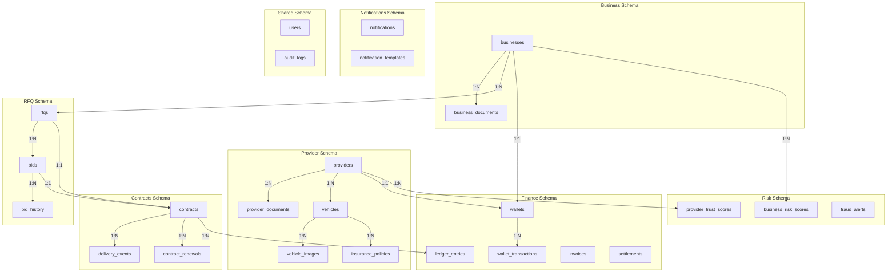

# Database Entity Relationship Diagram

## High-Level Schema Overview



## Detailed ERD by Module

### Module 1: Business & Provider Core

```
┌─────────────────────────┐
│   businesses            │
├─────────────────────────┤
│ PK id (UUID)            │
│    keycloak_user_id     │
│    company_name         │
│    registration_number  │
│    email                │
│    status               │
│    verification_status  │
│    ...                  │
└─────────────────────────┘
         │ 1
         │
         │ N
         ▼
┌─────────────────────────┐
│ business_documents      │
├─────────────────────────┤
│ PK id (UUID)            │
│ FK business_id          │
│    document_type        │
│    file_path            │
│    verification_status  │
│    ...                  │
└─────────────────────────┘

┌─────────────────────────┐
│   providers             │
├─────────────────────────┤
│ PK id (UUID)            │
│    keycloak_user_id     │
│    first_name           │
│    last_name            │
│    email                │
│    status               │
│    verification_status  │
│    ...                  │
└─────────────────────────┘
         │ 1
         │
         ├─────────────────┐
         │ N               │ N
         ▼                 ▼
┌──────────────────┐  ┌──────────────────┐
│ vehicles         │  │provider_documents│
├──────────────────┤  ├──────────────────┤
│ PK id            │  │ PK id            │
│ FK provider_id   │  │ FK provider_id   │
│    vehicle_type  │  │    document_type │
│    make/model    │  │    file_path     │
│    status        │  │    ...           │
└──────────────────┘  └──────────────────┘
         │ 1
         │
         ├─────────────────┐
         │ N               │ N
         ▼                 ▼
┌──────────────────┐  ┌──────────────────┐
│ vehicle_images   │  │insurance_policies│
├──────────────────┤  ├──────────────────┤
│ PK id            │  │ PK id            │
│ FK vehicle_id    │  │ FK vehicle_id    │
│    image_type    │  │ FK provider_id   │
│    file_path     │  │    policy_number │
│    ...           │  │    end_date      │
└──────────────────┘  └──────────────────┘
```

### Module 2: RFQ & Bidding

```
┌─────────────────────────┐
│   businesses            │
└─────────────────────────┘
         │ 1
         │
         │ N
         ▼
┌─────────────────────────┐
│   rfqs                  │
├─────────────────────────┤
│ PK id (UUID)            │
│ FK business_id          │
│    rfq_number           │
│    title                │
│    vehicle_type         │
│    start_date/end_date  │
│    status               │
│    bidding_deadline     │
│    ...                  │
└─────────────────────────┘
         │ 1
         │
         │ N
         ▼
┌─────────────────────────┐
│   bids                  │
├─────────────────────────┤
│ PK id (UUID)            │
│ FK rfq_id               │
│ FK provider_id          │
│ FK vehicle_id           │
│    bid_amount           │
│    daily_rate           │
│    status               │
│    rank                 │
│    final_score          │
│    ...                  │
└─────────────────────────┘
         │ 1
         │
         │ N
         ▼
┌─────────────────────────┐
│   bid_history           │
├─────────────────────────┤
│ PK id (UUID)            │
│ FK bid_id               │
│    action               │
│    old_amount           │
│    new_amount           │
│    changed_at           │
│    ...                  │
└─────────────────────────┘
```

### Module 3: Contracts & Delivery

```
┌─────────────────────────┐
│   rfqs                  │
└─────────────────────────┘
         │ 1
         │
         │ 1
         ▼
┌─────────────────────────┐
│   contracts             │
├─────────────────────────┤
│ PK id (UUID)            │
│ FK rfq_id               │
│ FK bid_id               │
│ FK business_id          │
│ FK provider_id          │
│ FK vehicle_id           │
│    contract_number      │
│    start_date/end_date  │
│    daily_rate           │
│    total_amount         │
│    status               │
│    ...                  │
└─────────────────────────┘
         │ 1
         │
         ├─────────────────┐
         │ N               │ N
         ▼                 ▼
┌──────────────────┐  ┌──────────────────┐
│ delivery_events  │  │contract_renewals │
├──────────────────┤  ├──────────────────┤
│ PK id            │  │ PK id            │
│ FK contract_id   │  │ FK contract_id   │
│    event_type    │  │    new_end_date  │
│    otp_code      │  │    additional_days│
│    otp_status    │  │    status        │
│    verified_at   │  │    ...           │
│    ...           │  └──────────────────┘
└──────────────────┘
```

### Module 4: Finance

```
┌─────────────────────────┐
│ businesses/providers    │
└─────────────────────────┘
         │ 1
         │
         │ 1
         ▼
┌─────────────────────────┐
│   wallets               │
├─────────────────────────┤
│ PK id (UUID)            │
│    owner_id             │
│    owner_type           │
│    balance              │
│    escrow_balance       │
│    available_balance    │
│    status               │
│    ...                  │
└─────────────────────────┘
         │ 1
         │
         │ N
         ▼
┌─────────────────────────┐
│ wallet_transactions     │
├─────────────────────────┤
│ PK id (UUID)            │
│ FK wallet_id            │
│    transaction_type     │
│    amount               │
│    balance_before/after │
│    reference_type/id    │
│    status               │
│    ...                  │
└─────────────────────────┘

┌─────────────────────────┐
│   contracts             │
└─────────────────────────┘
         │ 1
         │
         │ N
         ▼
┌─────────────────────────┐
│   ledger_entries        │
├─────────────────────────┤
│ PK id (UUID)            │
│ FK contract_id          │
│ FK business_id          │
│ FK provider_id          │
│    entry_date           │
│    daily_rate           │
│    platform_commission  │
│    provider_earnings    │
│    status               │
│    ...                  │
└─────────────────────────┘

┌─────────────────────────┐
│   businesses            │
└─────────────────────────┘
         │ 1
         │
         │ N
         ▼
┌─────────────────────────┐
│   invoices              │
├─────────────────────────┤
│ PK id (UUID)            │
│ FK business_id          │
│    invoice_number       │
│    billing_period       │
│    total_amount         │
│    status               │
│    due_date             │
│    ...                  │
└─────────────────────────┘

┌─────────────────────────┐
│   providers             │
└─────────────────────────┘
         │ 1
         │
         │ N
         ▼
┌─────────────────────────┐
│   settlements           │
├─────────────────────────┤
│ PK id (UUID)            │
│ FK provider_id          │
│    settlement_number    │
│    settlement_period    │
│    gross_earnings       │
│    net_amount           │
│    status               │
│    ...                  │
└─────────────────────────┘
```

### Module 5: Risk & Trust

```
┌─────────────────────────┐
│   businesses            │
└─────────────────────────┘
         │ 1
         │
         │ N
         ▼
┌─────────────────────────┐
│ business_risk_scores    │
├─────────────────────────┤
│ PK id (UUID)            │
│ FK business_id          │
│    overall_score        │
│    industry_risk_score  │
│    location_risk_score  │
│    risk_level           │
│    assessed_at          │
│    ...                  │
└─────────────────────────┘

┌─────────────────────────┐
│   providers             │
└─────────────────────────┘
         │ 1
         │
         │ N
         ▼
┌─────────────────────────┐
│ provider_trust_scores   │
├─────────────────────────┤
│ PK id (UUID)            │
│ FK provider_id          │
│    overall_score        │
│    completion_rate_score│
│    on_time_delivery     │
│    trust_level          │
│    total_contracts      │
│    ...                  │
└─────────────────────────┘

┌─────────────────────────┐
│   fraud_alerts          │
├─────────────────────────┤
│ PK id (UUID)            │
│    alert_type           │
│    severity             │
│    entity_type/id       │
│    description          │
│    status               │
│    ...                  │
└─────────────────────────┘
```

## Database Statistics

### Table Count by Schema

| Schema | Tables | Purpose |
|--------|--------|---------|
| business | 2 | Business entities and documents |
| provider | 5 | Provider, vehicles, documents, images, insurance |
| rfq | 3 | RFQs, bids, bid history |
| contracts | 3 | Contracts, delivery, renewals |
| finance | 5 | Wallets, transactions, ledger, invoices, settlements |
| risk | 3 | Risk scores, trust scores, fraud alerts |
| notifications | 2 | Notifications and templates |
| shared | 2 | Users and audit logs |
| **Total** | **25** | **All modules** |

### Estimated Row Growth (Year 1)

| Table | Estimated Rows | Growth Rate |
|-------|---------------|-------------|
| businesses | 100 | Low |
| providers | 500 | Medium |
| vehicles | 1,000 | Medium |
| rfqs | 5,000 | High |
| bids | 25,000 | High |
| contracts | 3,000 | Medium |
| ledger_entries | 90,000 | Very High |
| wallet_transactions | 50,000 | High |
| notifications | 100,000 | Very High |
| audit_logs | 500,000 | Very High |

### Storage Estimates (Year 1)

| Component | Size |
|-----------|------|
| Database (tables) | ~2 GB |
| Indexes | ~500 MB |
| Documents (MinIO) | ~50 GB |
| **Total** | **~52.5 GB** |

## Performance Optimization Summary

### Indexing Strategy
- ✅ All foreign keys indexed
- ✅ Status fields indexed
- ✅ Date fields indexed for range queries
- ✅ Unique constraints on business keys
- ✅ Composite indexes where needed

### Query Optimization
- ✅ Schema separation for logical isolation
- ✅ JSONB for flexible data with GIN indexes
- ✅ Soft deletes for data recovery
- ✅ Audit logging for compliance

### Scalability Features
- ✅ UUID primary keys for distributed systems
- ✅ Timestamp tracking on all tables
- ✅ Partitioning-ready (audit_logs, ledger_entries)
- ✅ Read replicas support (PostgreSQL)

---

## Next Steps

1. ✅ Schema design complete
2. Create EF Core entity classes
3. Create Fluent API configurations
4. Generate initial migration
5. Seed lookup/reference data
6. Create database views for reporting
7. Set up backup and recovery strategy
