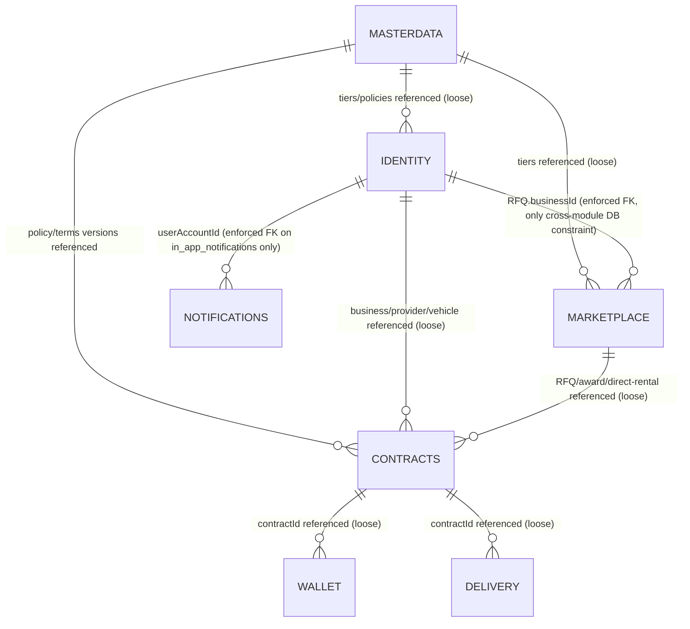

# Database Entity Relationship Diagram

**Last verified against code:** 2026-07-23
**Ground truth:** `backend/src/Marketplace.API/Migrations/MarketplaceDbContextModelSnapshot.cs` (the compiled current EF model) — same source used for `../02_DATABASE_SCHEMA_DESIGN.md`, which this document cross-references rather than duplicates. Read that file first for full column lists, migration history, and the naming/enum drift findings; this file is the relationship/shape view only.

This replaces the November 2025 draft in full. That draft's diagram used a fictional `business/provider/rfq/risk/notifications/shared` schema set — none of those are real schemas — and fictional tables (`wallets`, `ledger_entries`, `business_risk_scores`, `fraud_alerts`) that don't exist anywhere in the codebase. The real schema set is `masterdata`, `identity`, `marketplace`, `contracts`, `wallet` (the Finance module's real schema name — not `finance`), `delivery`, `notifications` — 119 tables total, diagrammed below.

**Reading the diagrams:** an enforced foreign key (real DB constraint, from `HasForeignKey`/`HasOne`/`HasMany` in the model) is drawn as a normal Mermaid relationship line. A **loose reference** — a bare `uuid`/`uuid?` column with no DB-level FK, which is how almost every cross-module reference in this codebase works by design (see `02_DATABASE_SCHEMA_DESIGN.md` §2.5) — is called out in prose underneath each diagram instead of drawn as a line, so the diagrams don't imply referential integrity that Postgres doesn't actually enforce.

---

## 1. Cross-Schema Overview

```mermaid
erDiagram
    MASTERDATA ||--o{ IDENTITY : "tiers/policies referenced (loose)"
    MASTERDATA ||--o{ CONTRACTS : "policy/terms versions referenced"
    MASTERDATA ||--o{ MARKETPLACE : "tiers referenced (loose)"
    IDENTITY ||--o{ MARKETPLACE : "RFQ.businessId (enforced FK, only cross-module DB constraint)"
    IDENTITY ||--o{ CONTRACTS : "business/provider/vehicle referenced (loose)"
    MARKETPLACE ||--o{ CONTRACTS : "RFQ/award/direct-rental referenced (loose)"
    CONTRACTS ||--o{ WALLET : "contractId referenced (loose)"
    CONTRACTS ||--o{ DELIVERY : "contractId referenced (loose)"
    IDENTITY ||--o{ NOTIFICATIONS : "userAccountId (enforced FK on in_app_notifications only)"
```

7 real PostgreSQL schemas, 119 tables. Module ↔ schema names match 1:1 **except Finance**, whose tables live in a schema named `wallet`. The `Auth` module owns zero tables (Keycloak/BFF integration only, layered on `identity.user_accounts`).

| Schema | Tables | Diagram |
|---|---:|---|
| `masterdata` | 26 | §2 |
| `identity` | 24 | §3 |
| `marketplace` | 17 | §4 |
| `contracts` | 12 | §5 |
| `wallet` (Finance) | 19 | §6 |
| `delivery` | 10 | §7 |
| `notifications` | 11 | §8 |

---

## 2. `masterdata` — Versioned Policy Engine + Lookups

```mermaid
erDiagram
    BUSINESS_TIER ||--o{ BUSINESS_TIER_RULE : "1:N cascade"
    PROVIDER_TIER ||--o{ PROVIDER_TIER_RULE : "1:N cascade"
    PROVIDER_TIER ||--o{ COMMISSION_STRATEGY_RULE : "1:N cascade"
    COMMISSION_STRATEGY_VERSION ||--o{ COMMISSION_STRATEGY_RULE : "1:N cascade"
    CONTRACT_POLICY_VERSION ||--o{ CONTRACT_POLICY_RULE : "1:N cascade"
    ESCROW_POLICY_VERSION ||--o{ ESCROW_POLICY_RULE : "1:N cascade"
    SETTLEMENT_POLICY_VERSION ||--o{ SETTLEMENT_POLICY_RULE : "1:N cascade"
    CONTRACT_TERMS_VERSION ||--o{ CONTRACT_TERMS_VERSION : "supersedesVersionId (self-FK, restrict)"
    DOCUMENT_TYPE ||--o{ KYC_REQUIREMENT : "1:N cascade"
    COUNTRY ||--o{ REGION : "1:N cascade"
    REGION ||--o{ CITY : "1:N cascade"
    LOOKUP_TYPE ||--o{ LOOKUP : "1:N cascade"
    LOOKUP_TYPE ||--o{ LOOKUP_TYPE_TRANSLATION : "1:N cascade"
    LOOKUP ||--o{ LOOKUP_TRANSLATION : "1:N cascade"
    SETTINGS ||--o{ SETTINGS_TRANSLATION : "1:N cascade"

    BUSINESS_TIER {
        uuid id PK
        string code
        int maxRfqsPerMonth
        int maxActiveContracts
    }
    BUSINESS_TIER_RULE {
        uuid id PK
        uuid businessTierId FK
        int minMonthlyRfqs
        numeric minMonthlySpend
        bool isDefaultForNew
    }
    PROVIDER_TIER {
        uuid id PK
        string code
        numeric commissionRate "seeded 10/8/6/5 percent"
    }
    PROVIDER_TIER_RULE {
        uuid id PK
        uuid providerTierId FK
        int minTrustScore
        int minCompletedContracts
        numeric minOnTimeRate
    }
    COMMISSION_STRATEGY_VERSION {
        uuid id PK
        int versionNumber
        bool isActive
    }
    COMMISSION_STRATEGY_RULE {
        uuid id PK
        uuid strategyVersionId FK
        uuid providerTierId FK
        string commissionType
    }
    CONTRACT_POLICY_VERSION { uuid id PK }
    CONTRACT_POLICY_RULE {
        uuid id PK
        uuid contractPolicyVersionId FK
        string scenarioCode
        int gracePeriodHours
    }
    CONTRACT_TERMS_VERSION {
        uuid id PK
        string sourceType "RFQ or DIRECT_RENTAL"
        int versionNumber
        uuid supersedesVersionId FK
    }
    ESCROW_POLICY_VERSION { uuid id PK }
    ESCROW_POLICY_RULE {
        uuid id PK
        uuid escrowPolicyVersionId FK
        int lockPeriodDays
    }
    SETTLEMENT_POLICY_VERSION { uuid id PK }
    SETTLEMENT_POLICY_RULE {
        uuid id PK
        uuid settlementPolicyVersionId FK
        string settlementFrequency
        int payoutDelayDays
    }
    DOCUMENT_TYPE { uuid id PK }
    KYC_REQUIREMENT {
        uuid id PK
        uuid documentTypeId FK
        string actorType
    }
    COUNTRY { uuid id PK }
    REGION { uuid id PK; uuid countryId FK }
    CITY { uuid id PK; uuid regionId FK }
    LOOKUP_TYPE { uuid id PK }
    LOOKUP { uuid id PK; uuid lookupTypeId FK }
    LOOKUP_TRANSLATION { uuid id PK; uuid lookupId FK }
    LOOKUP_TYPE_TRANSLATION { uuid id PK; uuid lookupTypeId FK }
    SETTINGS { uuid id PK; string key }
    SETTINGS_TRANSLATION { uuid id PK; uuid settingsId FK }
```

Not diagrammed (no FK to another masterdata table): `banks`, `checklist_template_items`, `profile_requirements`. All 12 `*_rule`/translation tables above are `OnDelete(Cascade)` from their parent version/type/lookup — deleting a policy version or lookup type deletes its rules/translations.

---

## 3. `identity` — Users, Business, Provider, Vehicle

```mermaid
erDiagram
    USER_ACCOUNT ||--o| BUSINESS : "1:1 restrict"
    USER_ACCOUNT ||--o| PROVIDER : "1:1 restrict"
    USER_ACCOUNT ||--o{ USER_DEVICE : "1:N cascade (+ shadow FK, see notes)"
    USER_ACCOUNT ||--o{ USER_LOGIN_SESSION : "1:N cascade"
    USER_LOGIN_SESSION ||--o{ USER_MFA_CHALLENGE : "1:N cascade"
    USER_ACCOUNT ||--o{ USER_DOCUMENT : "1:N cascade"
    USER_ACCOUNT ||--o{ RISK_EVENT : "1:N restrict"

    BUSINESS ||--o| BUSINESS_PROFILE : "1:1 cascade"
    BUSINESS ||--o{ BUSINESS_DOCUMENT : "1:N cascade"
    BUSINESS ||--o{ BUSINESS_BANK_ACCOUNT : "1:N cascade"

    PROVIDER ||--o| PROVIDER_PROFILE : "1:1 cascade"
    PROVIDER ||--o{ PROVIDER_DOCUMENT : "1:N cascade"
    PROVIDER ||--o{ PROVIDER_BANK_ACCOUNT : "1:N cascade"
    PROVIDER ||--o{ VEHICLE : "1:N cascade"
    PROVIDER ||--o{ PROVIDER_TIER_ASSIGNMENT : "1:N cascade"
    PROVIDER ||--o{ PROVIDER_TRUST_SCORE_HISTORY : "1:N cascade"

    VEHICLE ||--o{ VEHICLE_DOCUMENT : "1:N cascade"
    VEHICLE ||--o{ VEHICLE_INSURANCE : "1:N cascade"
    VEHICLE ||--o{ VEHICLE_STATUS_HISTORY : "1:N loose (no FK)"

    VERIFICATION_REQUEST ||--o{ COMPLIANCE_CHECK_LOG : "1:N cascade"

    USER_ACCOUNT {
        uuid id PK
        string keycloakUserId UK
        string email UK
        string status "plain string; UserStatus enum unused"
    }
    BUSINESS {
        uuid id PK
        uuid userAccountId FK "unique"
        string tinNumber UK
        string status "real enum BusinessStatus, string-converted"
    }
    PROVIDER {
        uuid id PK
        uuid userAccountId FK "unique"
        string tinNumber UK
        string status "real enum ProviderStatus"
        int trustScore "frozen at 50 in practice, see notes"
    }
    VEHICLE {
        uuid id PK
        uuid providerId FK
        string licensePlate UK
        string status "real enum VehicleStatus"
        bool isAvailableForDirectRental
        string_array tags
    }
    VEHICLE_INSURANCE { uuid id PK; uuid vehicleId FK }
    VEHICLE_DOCUMENT { uuid id PK; uuid vehicleId FK }
    VEHICLE_STATUS_HISTORY { uuid id PK; uuid vehicle_id FK "snake_case table" }
    BUSINESS_PROFILE { uuid id PK; uuid businessId FK "unique" }
    BUSINESS_DOCUMENT { uuid id PK; uuid businessId FK }
    BUSINESS_BANK_ACCOUNT { uuid id PK; uuid businessId FK }
    PROVIDER_PROFILE { uuid id PK; uuid providerId FK "unique" }
    PROVIDER_DOCUMENT { uuid id PK; uuid providerId FK }
    PROVIDER_BANK_ACCOUNT { uuid id PK; uuid providerId FK }
    PROVIDER_TIER_ASSIGNMENT { uuid id PK; uuid providerId FK; string tierCode "real enum ProviderTier" }
    PROVIDER_TRUST_SCORE_HISTORY { uuid id PK; uuid providerId FK }
    USER_DEVICE { uuid id PK; uuid userId FK; string pushToken }
    USER_DOCUMENT { uuid id PK; uuid userId FK }
    USER_LOGIN_SESSION { uuid id PK; uuid userId FK }
    USER_MFA_CHALLENGE { uuid id PK; uuid sessionId FK; uuid userId FK }
    RISK_EVENT { uuid id PK; uuid userId FK }
    ACCOUNT_FLAG { uuid id PK "loose actorId/actorType, no FK" }
    VERIFICATION_REQUEST { uuid id PK }
    COMPLIANCE_CHECK_LOG { uuid id PK; uuid verificationRequestId FK }
    VERIFICATION_EVENT_LOG { uuid id PK "loose entityId/entityType, no FK" }
```

**Notes:**
- `UserDevice` carries *two* relationships to `UserAccount` on the same table: a required cascade FK on `UserId`, plus an unconfigured shadow FK (`WithMany("Devices")`, no delete behavior) on `UserAccountId` — both point at the same parent table, which is redundant modeling rather than two real relationships.
- `AccountFlag` and `VerificationEventLog` are intentionally not linked by FK to `Business`/`Provider`/`Vehicle` — they're generic polymorphic audit tables keyed by a loose `(actorType, actorId)` / `(entityType, entityId)` pair.
- `Business.Status`, `Business.BusinessType`, `Provider.Status`, `Vehicle.Status`, `ProviderTierAssignment.TierCode` are the **only** status/type fields in the entire 119-table schema backed by a real C# enum (converted to a string column via `.HasConversion<string>()`). Everywhere else in the system, status is a bare `string` — see `02_DATABASE_SCHEMA_DESIGN.md` §2.4.

---

## 4. `marketplace` — RFQ / Bidding / Split-Award + Direct Rental

```mermaid
erDiagram
    RFQ ||--o{ RFQ_LINE_ITEM : "1:N cascade"
    RFQ ||--o{ RFQ_BID : "1:N cascade"
    RFQ ||--o{ RFQ_STATUS_HISTORY : "1:N cascade"
    RFQ_BID ||--o| RFQ_BID_AWARD : "1:1 cascade"
    RFQ_BID ||--o{ RFQ_BID_ITEM : "1:N cascade"
    RFQ_BID ||--o{ RFQ_BID_SNAPSHOT : "1:N cascade"
    RFQ_BID ||--o{ RFQ_BID_HISTORY : "1:N cascade"
    RFQ_LINE_ITEM ||--o{ RFQ_BID_ITEM : "1:N restrict"
    RFQ_LINE_ITEM ||--o{ RFQ_BID_AWARD : "1:N cascade"
    RFQ_LINE_ITEM ||--o{ RFQ_LINE_ITEM_FULFILLMENT : "1:N cascade"
    RFQ_BID_AWARD ||--o{ RFQ_AWARD_VEHICLE_ASSIGNMENT : "1:N cascade"
    RFQ_BID_AWARD ||--o{ RFQ_LINE_ITEM_FULFILLMENT : "1:N cascade"

    DIRECT_RENTAL_CART ||--o{ DIRECT_RENTAL_CART_ITEM : "1:N cascade"
    DIRECT_RENTAL_REQUEST ||--o{ DIRECT_RENTAL_REQUEST_LINE_ITEM : "1:N cascade"
    DIRECT_RENTAL_REQUEST_LINE_ITEM ||--o{ DIRECT_RENTAL_REQUEST_VEHICLE : "1:N cascade"
    DIRECT_RENTAL_REQUEST ||--o{ DIRECT_RENTAL_REQUEST_STATUS_HISTORY : "1:N cascade"

    RFQ {
        uuid id PK
        uuid businessId FK "ENFORCED cross-module FK, cascade"
        string status "DRAFT/PUBLISHED/BIDDING/PARTIALLY_AWARDED/AWARDED/COMPLETED/CANCELLED"
        bool isBlind
    }
    RFQ_LINE_ITEM {
        uuid id PK
        uuid rfqId FK
        int term "real enum RFQTerm, stored as integer"
        int fuelType "real enum FuelType, stored as integer"
    }
    RFQ_BID {
        uuid id PK
        uuid rfqId FK
        uuid providerId "loose"
        string status "SUBMITTED/WITHDRAWN/REJECTED/AWARDED"
    }
    RFQ_BID_ITEM { uuid id PK; uuid bidId FK; uuid rfqLineItemId FK }
    RFQ_BID_SNAPSHOT { uuid id PK; uuid rfqBidId FK; string hashedProviderId }
    RFQ_BID_HISTORY { uuid id PK; uuid rfqBidId FK; string previousStatus "nullable" }
    RFQ_BID_AWARD { uuid id PK; uuid rfqBidId FK "unique"; uuid rfqLineItemId FK }
    RFQ_AWARD_VEHICLE_ASSIGNMENT { uuid id PK; uuid rfqBidAwardId FK; uuid vehicleId "loose"; string status }
    RFQ_LINE_ITEM_FULFILLMENT { uuid id PK; uuid rfqLineItemId FK; uuid rfqBidAwardId FK }
    RFQ_STATUS_HISTORY { uuid id PK; uuid rfq_id FK "snake_case table" }
    MARKETPLACE_EVENT_LOG { uuid id PK "loose rfqId/rfqBidId" }

    DIRECT_RENTAL_CART { uuid id PK; uuid businessId "loose" }
    DIRECT_RENTAL_CART_ITEM { uuid id PK; uuid cartId FK; uuid vehicleId "loose" }
    DIRECT_RENTAL_REQUEST {
        uuid id PK
        uuid businessId "loose"
        uuid providerId "loose"
        string status
        bool isAllOrNone
    }
    DIRECT_RENTAL_REQUEST_LINE_ITEM { uuid id PK; uuid directRentalRequestId FK }
    DIRECT_RENTAL_REQUEST_VEHICLE { uuid id PK; uuid lineItemId FK; uuid vehicleId "loose" }
    DIRECT_RENTAL_REQUEST_STATUS_HISTORY { uuid id PK; uuid request_id FK "snake_case table" }
```

**Notes:**
- `RFQ.businessId → identity.businesses.id` is the **one confirmed cross-module enforced FK** in the entire database (§2.5 of the companion doc). Every other cross-schema arrow in every other diagram on this page is a loose reference, drawn in prose, not as a Mermaid relationship.
- The three-phase pattern — bid at fleet/quantity level (`RFQBid`/`RFQBidItem`) → line-item-scoped split award (`RFQBidAward`) → per-vehicle assignment (`RFQAwardVehicleAssignment`) — is identical across web and both mobile apps (coverage-audit §10.3 correction); it is not two divergent patterns as earlier audit drafts claimed.
- `RFQBidItem.RFQLineItemId` is `Restrict`-delete (can't delete a line item that already has bid items against it); almost everything else in this schema is `Cascade`.
- `Vehicle`/`Business`/`Provider` referenced from this schema (`DirectRentalCartItem.VehicleId`, `RFQBid.ProviderId`, etc.) are all loose Guids into the `identity` schema — no FK.

---

## 5. `contracts` — Lifecycle, Line Items, Vehicle Assignments, Terms

```mermaid
erDiagram
    CONTRACT ||--o| CONTRACT_PARTY_BUSINESS : "1:1 cascade, required"
    CONTRACT ||--o| CONTRACT_PARTY_PROVIDER : "1:1 cascade, required"
    CONTRACT ||--o| CONTRACT_TERMS_ACCEPTANCE : "1:1 cascade"
    CONTRACT ||--o{ CONTRACT_LINE_ITEM : "1:N cascade"
    CONTRACT ||--o{ CONTRACT_AMENDMENT : "1:N cascade"
    CONTRACT ||--o{ CONTRACT_PENALTY : "1:N cascade"
    CONTRACT ||--o{ CONTRACT_COMPLETION_REQUEST : "1:N cascade"
    CONTRACT ||--o{ CONTRACT_VEHICLE_ASSIGNMENT : "1:N cascade"
    CONTRACT ||--o{ CONTRACT_EVENT_LOG : "1:N cascade"
    CONTRACT ||--o{ CONTRACT_STATUS_HISTORY : "1:N cascade"
    CONTRACT ||--o{ CONTRACT_POLICY_SNAPSHOT : "1:N cascade"
    CONTRACT_LINE_ITEM ||--o{ CONTRACT_VEHICLE_ASSIGNMENT : "1:N cascade"

    CONTRACT {
        uuid id PK
        string contractNumber UK
        uuid businessId "loose"
        uuid providerId "loose"
        uuid rfqId "loose, nullable"
        uuid rfqBidAwardId "loose, nullable"
        uuid directRentalRequestId "loose, nullable"
        string sourceType "RFQ or DIRECT_RENTAL"
        string status "plain string; 18 real values, see state-machine doc"
    }
    CONTRACT_LINE_ITEM {
        uuid id PK
        uuid contractId FK
        uuid rfqLineItemId "loose"
        uuid directRentalRequestLineItemId "loose"
        string status "7 real values"
        int quantityAwarded
        int quantityActive
        int quantityDelivered
        int quantityReturned
    }
    CONTRACT_VEHICLE_ASSIGNMENT {
        uuid id PK
        uuid contractId FK
        uuid contractlineitemid FK "irregular column casing, see notes"
        uuid vehicleId "loose"
        string status "ASSIGNED/DELIVERED/RETURNED/REPLACED/REMOVED"
    }
    CONTRACT_PARTY_BUSINESS { uuid id PK; uuid contractId FK "unique"; uuid businessId }
    CONTRACT_PARTY_PROVIDER { uuid id PK; uuid contractId FK "unique"; uuid providerId }
    CONTRACT_TERMS_ACCEPTANCE {
        uuid id PK
        uuid contractId FK "unique"
        uuid termsVersionId FK "restrict, to masterdata"
        bool businessOtpConfirmed
        bool providerOtpConfirmed
    }
    CONTRACT_AMENDMENT { uuid id PK; uuid contractId FK; string status "zero callers" }
    CONTRACT_PENALTY { uuid id PK; uuid contractId FK; string status "zero callers" }
    CONTRACT_COMPLETION_REQUEST { uuid id PK; uuid contractId FK; string requestedByParty }
    CONTRACT_EVENT_LOG { uuid id PK; uuid contractId FK }
    CONTRACT_STATUS_HISTORY { uuid id PK; uuid contract_id FK "snake_case table" }
    CONTRACT_POLICY_SNAPSHOT { uuid id PK; uuid contractId FK; string policyJson }
```

**Notes:**
- `Contract.Status` is a plain `string`, not the `ContractStatus` C# enum that exists in the same module's `Domain/Enums/` folder — that enum is **dead code**, referenced nowhere outside its own file. Full 18-state transition matrix: `../MVP_final_docs/MVP_CONTRACT_STATE_MACHINE.md`.
- `ContractVehicleAssignment`'s FK to `ContractLineItem` uses the column name `contractlineitemid` (no camelCase, no snake_case) — a one-off casing irregularity, not a typo in this document.
- `Contract.BusinessId`/`ProviderId`/`RFQId`/`RFQBidAwardId`/`DirectRentalRequestId` are all loose references into `identity`/`marketplace` — no enforced FK crosses out of the `contracts` schema in either direction (recall `RFQ.BusinessId → identity.businesses` is the only cross-schema FK anywhere, and it points the other way).
- `ContractAmendment` and `ContractPenalty` are fully modeled (including sign/waive/dispute methods on the entities) but have zero callers anywhere in the codebase today — real tables, dead feature.
- Not shown: `contracts.early_return_notices` — a table still created by the migration history but **absent from the current EF model entirely** (no entity mapping at all, not even a dead one). See `02_DATABASE_SCHEMA_DESIGN.md` §2.6.

---

## 6. `wallet` (Finance module) — Wallets, Escrow, Settlement, Payments

```mermaid
erDiagram
    WALLET_ACCOUNT ||--o{ ESCROW_LOCK : "1:N cascade"
    WALLET_ACCOUNT ||--o{ WALLET_LEDGER_ENTRY : "1:N cascade"
    WALLET_ACCOUNT ||--o{ WALLET_BALANCE_SNAPSHOT : "1:N cascade"
    WALLET_ACCOUNT ||--o{ PAYMENT_INTENT : "1:N cascade"
    WALLET_ACCOUNT ||--o{ WITHDRAWAL_REQUEST : "1:N cascade"
    WALLET_ACCOUNT ||--o{ DEPOSIT_REQUEST : "1:N restrict"
    WALLET_ACCOUNT ||--o{ SETTLEMENT_PAYOUT : "1:N cascade"
    WALLET_ACCOUNT ||--o{ WALLET_EVENT_LOG : "1:N set-null"
    WALLET_LEDGER_TRANSACTION ||--o{ WALLET_LEDGER_ENTRY : "1:N cascade"
    WALLET_LEDGER_TRANSACTION ||--o{ WALLET_EVENT_LOG : "1:N set-null"
    ESCROW_LOCK ||--o{ ESCROW_ROLLOVER : "1:N set-null"
    ESCROW_LOCK ||--o{ MONTHLY_SETTLEMENT_SCHEDULE : "1:N (no override)"
    SETTLEMENT_CYCLE ||--o{ SETTLEMENT_PAYOUT : "1:N cascade"
    SETTLEMENT_CYCLE ||--o{ SETTLEMENT_STATUS_HISTORY : "1:N cascade"
    SETTLEMENT_PAYOUT ||--o{ SETTLEMENT_PAYOUT_LINE_ITEM : "1:N cascade"
    PROVIDER_INVOICE ||--o{ SETTLEMENT_PAYOUT : "1:N (no override)"
    PLATFORM_BANK_ACCOUNT ||--o{ DEPOSIT_REQUEST : "1:N restrict"

    WALLET_ACCOUNT {
        uuid id PK
        uuid ownerId "loose, into identity"
        string ownerType "USER/BUSINESS/PROVIDER/PLATFORM"
        string accountType "MAIN/ESCROW/COMMISSION/TAX"
        string status "ACTIVE/SUSPENDED/CLOSED"
        bytea rowVersion "real optimistic concurrency token"
    }
    ESCROW_LOCK {
        uuid id PK
        uuid walletAccountId FK
        uuid contractId "loose"
        string status "LOCKED/RELEASED/PARTIALLY_RELEASED/DISPUTED/FORFEITED"
    }
    ESCROW_ROLLOVER {
        uuid id PK
        uuid appliedToEscrowLockId FK
        uuid contractId "loose"
        string status "AVAILABLE/APPLIED/EXCESS_REFUNDED"
    }
    MONTHLY_SETTLEMENT_SCHEDULE {
        uuid id PK
        uuid escrowLockId FK
        uuid contractId "loose"
        string status "PENDING/LOCKED/SETTLED/CANCELLED"
    }
    SETTLEMENT_CYCLE { uuid id PK; string cycleReference UK; string status "OPEN/PROCESSING/CLOSED" }
    SETTLEMENT_PAYOUT {
        uuid id PK
        uuid settlementCycleId FK
        uuid walletAccountId FK
        uuid invoiceId FK
        uuid walletTransactionId FK
        string status
    }
    SETTLEMENT_PAYOUT_LINE_ITEM { uuid id PK; uuid settlementPayoutId FK; uuid contractId "loose" }
    SETTLEMENT_STATUS_HISTORY { uuid id PK; uuid settlement_cycle_id FK "snake_case table" }
    PROVIDER_INVOICE { uuid id PK; uuid providerId "loose"; string status }
    COMMISSION_ENTRY { uuid id PK; uuid contractId "loose"; uuid providerId "loose"; string status }
    WALLET_LEDGER_TRANSACTION { uuid id PK; string reference UK "column literally named transactionReference" }
    WALLET_LEDGER_ENTRY { uuid id PK; uuid transactionId FK; uuid walletAccountId FK; string entryType }
    WALLET_BALANCE_SNAPSHOT { uuid id PK; uuid walletAccountId FK }
    WALLET_EVENT_LOG { uuid id PK; uuid transactionId FK; uuid walletAccountId FK }
    PAYMENT_INTENT { uuid id PK; uuid walletAccountId FK; string status }
    DEPOSIT_REQUEST { uuid id PK; uuid walletAccountId FK; uuid platformBankAccountId FK; string status }
    WITHDRAWAL_REQUEST { uuid id PK; uuid walletAccountId FK; string status }
    REFUND_REQUEST { uuid id PK; uuid contractId "loose"; uuid businessId "loose"; string status }
    PLATFORM_BANK_ACCOUNT { uuid id PK }
```

**Notes:**
- This schema is named `wallet`, not `finance` — the C# module is `Modules/Finance/`, but every table it owns lives under `EnsureSchema(name: "wallet")`.
- Two competing escrow-computation code paths exist upstream of these tables (`FinanceBidAwardedEventHandler` using the MasterData policy engine vs. `ContractCreatedEventHandler` using a hardcoded 30-day-cap constant) — only the hardcoded path runs in production; they also look up the platform commission wallet via two different `AccountType` string literals (`"COMMISSION"` vs `"PLATFORM_COMMISSION"`). Neither inconsistency is visible in the schema shape itself, only in the application code that writes to `WALLET_ACCOUNT`/`ESCROW_LOCK`.
- `WalletAccount.RowVersion` (`bytea`, `IsConcurrencyToken`) is the **only** table in the database using EF's optimistic-concurrency token pattern.
- `CommissionEntry` is read by four admin report-query handlers that are wired to zero controllers — fully built, unreachable via any API.
- `ContractId`/`ProviderId`/`BusinessId` throughout this schema are all loose references into `contracts`/`identity` — none are enforced FKs, consistent with the module-isolation pattern elsewhere.

---

## 7. `delivery` — OTP Delivery/Return, Handover, Inspection

```mermaid
erDiagram
    DELIVERY_SESSION ||--o| DELIVERY_VEHICLE_HANDOVER : "1:1 cascade"
    DELIVERY_SESSION ||--o| VEHICLE_INSPECTION_CHECKLIST : "1:1 restrict"
    DELIVERY_SESSION ||--o{ DELIVERY_OTP : "1:N cascade"
    DELIVERY_SESSION ||--o{ DELIVERY_SLA_VIOLATION : "1:N cascade"
    DELIVERY_RETURN_SESSION ||--o| VEHICLE_INSPECTION_CHECKLIST : "1:1 restrict"
    DELIVERY_RETURN_SESSION ||--o{ RETURN_OTP : "1:N cascade"
    VEHICLE_INSPECTION_CHECKLIST ||--o{ VEHICLE_INSPECTION_CHECKLIST_RESPONSE : "1:N cascade"

    DELIVERY_SESSION {
        uuid id PK
        uuid contractId "loose"
        uuid businessId "loose"
        uuid providerId "loose"
        uuid vehicleId "loose"
        string status "default SCHEDULED"
    }
    DELIVERY_RETURN_SESSION {
        uuid id PK
        uuid contractId "loose"
        string status "default SCHEDULED"
    }
    DELIVERY_OTP { uuid id PK; uuid deliverySessionId FK; string code }
    RETURN_OTP { uuid id PK; uuid returnSessionId FK; string code }
    DELIVERY_VEHICLE_HANDOVER { uuid id PK; uuid deliverySessionId FK "unique"; double odometerReading }
    VEHICLE_INSPECTION_CHECKLIST {
        uuid id PK
        uuid deliverySessionId FK "unique, nullable"
        uuid returnSessionId FK "unique, nullable"
        string status "default SUBMITTED"
    }
    VEHICLE_INSPECTION_CHECKLIST_RESPONSE { uuid id PK; uuid checklistId FK; uuid templateItemId "loose, into masterdata" }
    DELIVERY_SLA_VIOLATION { uuid id PK; uuid deliverySessionId FK "zero writers" }
    DELIVERY_FAILURE_REASON { uuid id PK; string code UK }
    DELIVERY_EVENT_LOG { uuid id PK; uuid deliverySessionId "loose, zero writers" }
```

**Notes:**
- **No table in this schema has a latitude/longitude column.** `DeliverySession`/`DeliveryReturnSession` confirm the coverage audit's finding at the schema level: GPS arrival confirmation, assumed by `15_Delivery_OTP_Verification_Flow_Specification.md`, has no column to store it in.
- `VehicleInspectionChecklist` attaches to exactly one of `DeliverySession` or `DeliveryReturnSession` (both FKs nullable+unique, `Restrict`-delete) — one checklist per handover event, whichever direction.
- `DeliverySLAViolation` and `DeliveryEventLog` are real tables with zero writers anywhere in the codebase (coverage-audit §10.5) — modeled, never populated.
- `templateItemId` on the response table is a loose reference to `masterdata.checklist_template_items` — the only cross-schema reference in this diagram, and it's unenforced like almost all the others.

---

## 8. `notifications` — Multi-Channel Send + Template + Config

```mermaid
erDiagram
    EMAIL_NOTIFICATION_TEMPLATE ||--o{ EMAIL_NOTIFICATION : "1:N restrict"
    EMAIL_NOTIFICATION ||--o{ EMAIL_NOTIFICATION_OUTBOX : "1:N cascade"
    SMS_NOTIFICATION_TEMPLATE ||--o{ SMS_NOTIFICATION : "1:N restrict"
    SMS_NOTIFICATION ||--o{ SMS_NOTIFICATION_OUTBOX : "1:N cascade"
    IN_APP_NOTIFICATION_TEMPLATE ||--o{ IN_APP_NOTIFICATION : "1:N restrict"

    EMAIL_NOTIFICATION_TEMPLATE { uuid id PK; string code; string language }
    EMAIL_NOTIFICATION { uuid id PK; uuid templateId FK; string emailAddress; string deliveryStatus }
    EMAIL_NOTIFICATION_OUTBOX { uuid id PK; uuid emailNotificationId FK; int retryCount; string status }
    SMS_NOTIFICATION_TEMPLATE { uuid id PK }
    SMS_NOTIFICATION { uuid id PK; uuid templateId FK; string phoneNumber }
    SMS_NOTIFICATION_OUTBOX { uuid id PK; uuid smsNotificationId FK }
    IN_APP_NOTIFICATION_TEMPLATE { uuid id PK }
    IN_APP_NOTIFICATION {
        uuid id PK
        uuid templateId FK
        uuid userAccountId FK "the only sent-record FK into identity"
        bool isRead
    }
    EMAIL_PROVIDER_CONFIG { uuid id PK; string providerType; bool isEnabled }
    SMS_PROVIDER_CONFIG { uuid id PK; string providerType; bool isEnabled }
    FCM_PROVIDER_CONFIG { uuid id PK; string projectId; bool isEnabled }
```

**Notes:**
- `InAppNotification.userAccountId` is the only "sent record" FK in this schema pointing at `identity.user_accounts` — `EmailNotification`/`SmsNotification` address recipients directly by email/phone instead of by user ID.
- `*ProviderConfig` tables (email/SMS/FCM) hold live provider credentials (SMTP password, SMS API key, Firebase service-account private key) — all marked `*Encrypted` in the column name, not diagrammed with attribute detail here since they carry no relational structure of their own.
- Outbox tables denormalize a full copy of recipient/subject/body/payload alongside the FK to their parent sent-record row, so the retry scheduler never has to join back to it.

---

## 9. What This Diagram Deliberately Leaves Out

Per `02_DATABASE_SCHEMA_DESIGN.md` §2.7, every one of the 119 tables also carries `id`, `createdAt`, `updatedAt`, `createdBy`, `updatedBy`, `isDeleted` — omitted from every entity box above to keep the diagrams legible. Full column lists, types, indexes, and every named constraint live in that document, organized in the same schema order as this one (§3–§9 there ↔ §2–§8 here).
